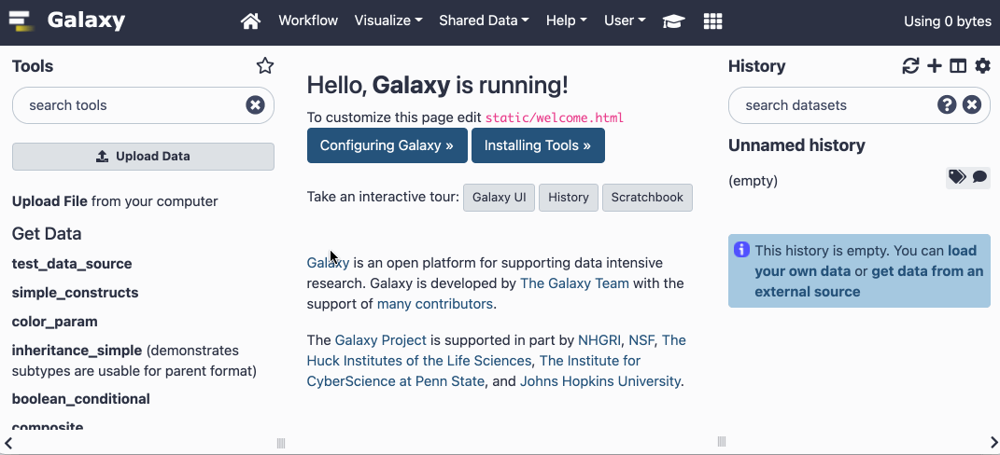

# IWC - Intergalactic Workflow Commission

## The IWC maintains high-quality Galaxy Workflows

Workflows are categorized in the [workflows](workflows/) directory, and listed in [Dockstore](https://dockstore.org/organizations/iwc) and [WorkflowHub](https://workflowhub.eu/search?utf8=%E2%9C%93&q=IWC#workflows).

All workflows are reviewed and tested before publication and with every new Galaxy release.
Deposited workflows follow [best practices](https://planemo.readthedocs.io/en/latest/best_practices_workflows.html) and are versioned using github releases.
Workflows also contain important metadata, such as:

- License
- Author
- Institutes

Additionally the IWC will collect further best practices, tips and tricks, FAQs and assist the community in designing high-quality Galaxy workflows.

## Importing Workflows into Galaxy

To import IWC workflows into your Galaxy instance use the TRS workflow search in the Galaxy interface.
Click on "Workflows", "Import" and click on the "search form" link.
Select a TRS server from the drop-down menu and enter `organization:iwc` (for workflowhub.eu) or `organization:iwc-workflows` (for Dockstore) in the text box.

## Accessing IWC workflows via usegalaxy.* servers

All IWC workflows are automatically installed onto usegalaxy.* servers (i.e. [Galaxy Main](https://usegalaxy.org), [Galaxy Europe](https://usegalaxy.eu), [Galaxy Australia](https://usegalaxy.org.au)). They can be accessed via the following lists of published workflows:
* https://usegalaxy.org/workflows/list_published
* https://usegalaxy.eu/workflows/list_published
* https://usegalaxy.org.au/workflows/list_published

## Contributing a Workflow

Anyone can contribute a production Galaxy Workflow. Please check out the [Adding workflow guidelines](workflows/README.md#adding-workflows).

If linting passes, tests pass, and human review passes, the PR is merged and

- uploaded to a separate repository in <https://github.com/iwc-workflows> for versioning purposes
- registered in the [iwc organization](https://dockstore.org/organizations/iwc) on [Dockstore](https://dockstore.org/)
- registered in [WorkflowHub](https://workflowhub.eu/projects/33#workflows)

## Becoming a IWC member

Everyone is welcome and can help out with reviewing workflows. Post a comment [here](https://github.com/galaxyproject/iwc/issues/4) with your expertise and we will add you to the IWC organization.
