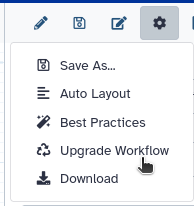

# Workflows

This directory contains all IWC workflows.

## Structure of the directory

The structure is as follows:

* top-level directories represent categories, e.g., `sars-cov-2-variant-calling`;
* directories right under the top level represent individual workflow repositories, e.g., `sars-cov-2-consensus-from-variation` which will be deployed to https://github.com/iwc-workflows/sars-cov-2-consensus-from-variation;
* please, only use lower case and `-` in directory names.
* workflow repository directories contain:

  * at least one `.ga` workflow file, e.g., `consensus-from-variation.ga`;
  * as many [Planemo test file](https://planemo.readthedocs.io/en/latest/test_format.html) as workflow files, with the same name as the workflow file, but with a `-tests.yml` extension, e.g., `consensus-from-variation-tests.yml`;
  * a `test-data` directory with the test data used by Planemo (optional);
  * a [Dockstore](https://dockstore.org) [metadata file](https://docs.dockstore.org/en/develop/getting-started/github-apps/github-apps.html#workflow-yml-file) named `.dockstore.yml`;
  * a `README.md` and a `CHANGELOG.md` file.

## Adding workflows

Here are some guidelines to help new contributors to add their workflows.

Everything starts from a workflow that you have on a galaxy instance.

### Optional: Updating tools

It is recommended to check and update tools with Planemo before import.

 - You can do it from the galaxy instance using "Workflow Options" "Upgrade Workflow":

 
 
 - Or by downloading the ga file and running planemo:

  ```bash
  planemo autoupdate <workflow.ga>
  ```

### Ensure workflows follow best-practices

The best way is to check it into a galaxy instance: click on "Workflow Options", select "Best Practices" and apply the suggested improvements. In particular, in order to make the workflow usable, **make sure you specify a license**. Another important field is "Creator", which allows to give proper credit to the author(s). The "Identifier" field of a Creator added as a _person_ should be filled with a fully qualified URI, e.g., https://orcid.org/0000-0002-1825-0097.


If you add an _organization_ as Creator, you should include a "URL" field pointing to the organization's web site, e.g., https://github.com/galaxyproject/iwc.


### Generate tests

This is usually the most difficult part and we encourage all new contributors to IWC to propose their workflows even if they did not managed to generate tests. However, the publication of these workflow will be speed up if tests are already present.
To generate tests, you can either write test cases by hand, or use a workflow invocation to generate a test case (see below).

#### Find input datasets

If your analysis is covered by the GTN, using GTN dataset material is a good start! If it is not, try to generate a toy dataset for example following [this](https://training.galaxyproject.org/training-material/topics/contributing/tutorials/create-new-tutorial/tutorial.html#get-a-toy-dataset) and then publish it to zenodo to have a permanent URL.

#### Generate test from a workflow invocation

Create a new directory under one of the directories that represent categories. If no category is suitable you can create a new category directory.
Name the directory that contains your workflow(s) appropriately, as it will become the name of the repository deployed to [iwc-workflows github organization](https://github.com/iwc-workflows). Only use lower-case and `-` in names of categories and repositories.

Execute the workflow on your Galaxy server using the smallest input data you can generate.
Go to the workflow invocations page:
- Before 24.0: (User > Workflow Invocations)
- In 24.0: (Data > Workflow Invocations)
- Above 24.1: In the activity bar in Workflow Invocation.

Open the most recent item and find the invocation id:

In below 24.0, you can get it here:


If you have the activity bar, you can find the workflow invocation id from the URL. For example, `https://usegalaxy.org/workflows/invocations/be5c48c113145dd5?from_panel=true` means that the workflow invocation id is `be5c48c113145dd5`.

You will also need your Galaxy API key. To copy it, or generate it if you don't have one yet, go to User > Preferences > Manage API Key. Then run:

```
planemo workflow_test_init --from_invocation <your_invocation_id> --galaxy_url <your_prefered_galaxy_instance_url> --galaxy_user_key <your_api_key>
```

This will place the workflow and workflow test files in your current working directory.
You may still want to remove test files and edit the test comparisons so that tests
will pass reliably. For example, you could consider using assertions to test the
outputs, rather than comparing the entire output file with test data.
Also, if some outputs are large, it is better to use assertions than storing the whole output file to the iwc repository.
The description of assertion can be find in [the documentation](https://docs.galaxyproject.org/en/latest/dev/schema.html#tool-tests-test-output-assert-contents). Do not hesitate to look at different test files in the repo for examples.

#### Manually write test for workflow

Download the workflow and place it in a new directory under one of the directories that represent categories. If no category is suitable you can create a new category directory.
Name the directory that contains your workflow(s) appropriately, as it will become the name of the repository deployed to [iwc-workflows github organization](https://github.com/iwc-workflows). Only use lower-case and `-` in names of categories and repositories.
You can then generate a template planemo test file with planemo:

```bash
planemo workflow_test_init <your_workflow_file.ga>
```

If you run it on `parallel-accession-download.ga`, this generates the file parallel-accession-download-tests.yml:

```yaml
- doc: Test outline for parallel-accession-download.ga
  job:
    Run accessions:
      class: File
      path: todo_test_data_path.ext
  outputs:
    Paired End Reads:
      class: ''
    Single End Reads:
      class: ''
```

We now need to provide inputs and outputs. You can find details about the test format in the [planemo documentation](https://planemo.readthedocs.io/en/latest/test_format.html). You can also check other test files into this repository to get examples.
For this example workflow the final parallel-accession-download-tests.yml might look like this:

```yaml
- doc: Test download of single end accession
  job:
    Run accessions:
      class: File
      path: test-data/input_accession_single_end.txt
  outputs:
    Single End Reads:
      element_tests:
        SRR044777:
          file: test-data/SRR044777_head.fastq
          decompress: true
          compare: contains
```

#### Lint your workflow

Note that we've removed the "Paired End Reads" output, since the accession we test is a single end accession.
We can now run `planemo workflow_lint` to make sure the workflow and its test are syntactically correct:

```console
$ planemo workflow_lint parallel-accession-download.ga
Applying linter tests... CHECK
.. CHECK: Tests appear structurally correct for parallel-accession-download.ga
```

#### Test your workflow against an instance which have all tools installed.

Before running the CI, it might be interesting to run your tests against a galaxy instance using planemo so you can easily see what is failing and what are the differences between your expectations and the output you get:

```bash
planemo test --galaxy_url <your_prefered_galaxy_server> --galaxy_user_key <your_api_key> <workflow.ga>
```

If your tests are not passing because you made an error into your test file you can modify your test file and use planemo to check that the test is valid against the same invocation.

planemo workflow_test_on_invocation --galaxy_url <your_prefered_galaxy_server --galaxy_user_key <your_api_key> <workflow-tests.yml> <invocation_id>

Note: If your workflow is using build-in indexes, note that the CI will use CVMFS. You can browse the available indexes at http://datacache.galaxyproject.org/. 

#### Add required metadata

We now need to generate a `.dockstore.yml` file that contains metadata needed for [Dockstore](https://dockstore.org/organizations/iwc).
`planemo dockstore_init` operates on a directory of workflows. If your current working directory contains the workflow(s) run

```console
$ planemo dockstore_init .

```

to generate a `.dockstore.yml` file.

We now only need a README.md file that briefly describes the workflow and a CHANGELOG.md file
that lists changes, additions and fixed. Please follow the formatting and principles proposed on [keepachangelog.com](https://keepachangelog.com/en/1.0.0/).

We currently do not have a user interface within Galaxy to define release versions, so you have to manually set a `release: "0.1"` key value pair in the workflow.ga file.
With a text editor of your choice make this change:

```diff
     ],
     "format-version": "0.1",
     "license": "MIT",
+    "release": "0.1",
     "name": "Parallel Accession Download",
     "steps": {
         "0": {
```

At this point you can commit the new files and open a pull request.
If you are encountering difficulties at any point don't hesitate to ask for help on [gitter](https://gitter.im/galaxyproject/iwc).

### Multiple directories or multiple workflows into the same directory

The submitter is free to choose what will match the best its case.
When multiple workflows are in the same directory, the submitter must know that:
- The CHANGELOG.md is common and all workflows must constantly have the same version.
- Workflowhub does not support multiple 'main' workflows in the same directory. One of the workflow will be considred as the main one while all others will be considered as subworkflows. However, this is not an issue for dockstore which will publish each workflow listed in the dockstore file as main.
- If you want to decide which one is the main, you should write the `.workflowhub.yml` manually.

## RO-Crate Metadata

[RO-Crate](https://doi.org/10.3233/DS-210053) is a format for packaging research artifacts along with their metadata in a machine readable manner. The base RO-Crate specification is complemented by a set of _profiles_ tailored to more specific domains: in particular, [Workflow RO-Crate](https://about.workflowhub.eu/Workflow-RO-Crate/) can be used to package computational workflows, and [Workflow Testing RO-Crate](https://crs4.github.io/life_monitor/workflow_testing_ro_crate) further describes how to add metadata related to workflow testing.

Workflow Testing RO-Crate metadata is automatically generated and added to the workflow repository after a PR is merged, before the repository is deployed to [iwc-workflows](https://github.com/iwc-workflows). RO-Crate metadata is based on [Schema.org](https://schema.org/) annotations in [JSON-LD](https://json-ld.org/) ([example](https://github.com/iwc-workflows/parallel-accession-download/blob/7971b6dc0ee246262a1898e7c7016143ff63007c/ro-crate-metadata.json)). The Workflow Testing RO-Crate representation of the repository ensures its compatibility with the [WorkflowHub](https://workflowhub.eu) registry and the [LifeMonitor](https://www.lifemonitor.eu) workflow health monitoring service.

To ensure that the RO-Crate metadata generation succeeds, make sure you apply the best practices described in the [section on adding workflows](#adding-workflows). In particular, the conversion tool expects to find the workflow file and the Planemo test file; a `README.md` file is not expected, but it will be included if found. The workflow file should specify a `license`, a `release` and one or more `creator`s among its metadata.

## Workflow auto-update

### Code links and steps

The workflows submitted to iwc are updated automatically. We describe here where you can find the code of each step of this process and what they are doing today (2024-06-23).

- Once a week the github workflow described [here](https://github.com/planemo-autoupdate/autoupdate/blob/main/.github/workflows/autoupdate.yml) will be run:
  - The fork of iwc of the planemo-autoupdate author ([here](https://github.com/planemo-autoupdate/iwc/)) is cloned.
  - For each workflow directory like  `workflows/data-fetching/parallel-accession-download`:
    - If there is already a PR by planemo-autodupdate for this workflow, the git is checkout to the corresponding branch. If there is no PR the potential existing branch is deleted and the new branch is created.
    - `planemo autoupdate` is run in the directory using the [skip list](https://github.com/planemo-autoupdate/autoupdate/blob/main/galaxyproject_iwc_skip_list).
      - Toolshed updates are checked for all tools used in the workflow. If there are updates, the new version will be used and parameter values will be kept if they stay in the same section with the same name.
    - If there is a change in the workflow.
      - The `CHANGELOG.md` is updated using the [python script](https://github.com/planemo-autoupdate/autoupdate/blob/main/pr_text_iwc.py): the log of `planemo autoupdate` is analysed and if there is no PR opened the CHANGELOG file is updated, on top is written the release number and the date. Then under the Automatic update title is written a list of the changes.
      - If there is a closed PR with the same title. Then everything is cancelled.
      - If a PR was already opened, the title is updated (but the CHANGELOG has not been updated).
      - If no PR was opened, a new PR is opened.

### FAQ
- A workflow has not been updated while it has tools that have newer versions available?
  - Check the [autoupdate actions](https://github.com/planemo-autoupdate/autoupdate/actions). Maybe one workflow raise an error while updating and this prevents other workflows to be updated. Please report this to the matrix channel.
  - Check that there is no closed PR named 'Updating blabla from xx to xx' corresponding to your workflow. This would prevent any automatic update. If this is the case, leave a comment into this PR so IWC reopen it.
