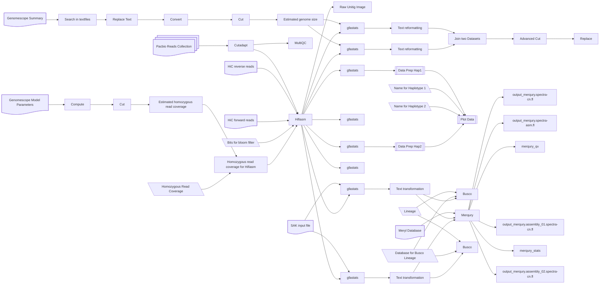
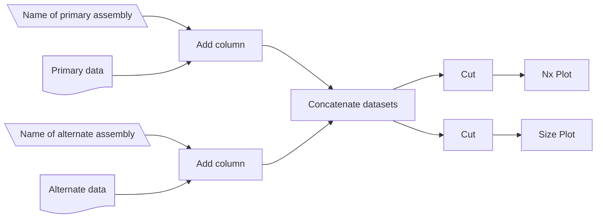
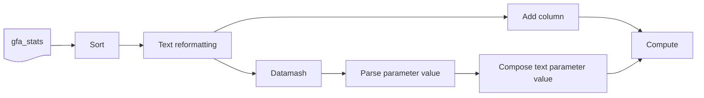

# Workflow diagrams

## Assembly-Hifi-HiC-phasing-VGP4

```mermaid
graph LR
0["Pacbio Reads Collection"]@{ shape: docs }
1["HiC forward reads"]@{ shape: doc }
2["HiC reverse reads"]@{ shape: doc }
3["Genomescope Summary"]@{ shape: doc }
4["Meryl Database"]@{ shape: doc }
5["Database for Busco Lineage"]@{ shape: lean-l }
6["Lineage"]@{ shape: lean-l }
7["Name for Haplotype 1"]@{ shape: lean-l }
8["Name for Haplotype 2"]@{ shape: lean-l }
9["Bits for bloom filter"]@{ shape: lean-l }
10["SAK input file"]@{ shape: doc }
11["Homozygous Read Coverage"]@{ shape: lean-l }
12["Genomescope Model Parameters"]@{ shape: doc }
13["Cutadapt"]@{ shape: process }
0 --> 13
14["Search in textfiles"]@{ shape: process }
3 --> 14
15["Compute"]@{ shape: process }
12 --> 15
16["MultiQC"]@{ shape: process }
13 --> 16
17["Replace Text"]@{ shape: process }
14 --> 17
18["Cut"]@{ shape: process }
15 --> 18
19["Convert"]@{ shape: process }
17 --> 19
20["Estimated homozygous read coverage"]@{ shape: process }
18 --> 20
21["Cut"]@{ shape: process }
19 --> 21
22["Homozygous read coverage for Hifiasm"]@{ shape: process }
11 --> 22
20 --> 22
23["Estimated genome size"]@{ shape: process }
21 --> 23
24["Hifiasm"]@{ shape: process }
22 --> 24
9 --> 24
1 --> 24
2 --> 24
13 --> 24
25["Raw Unitig Image"]@{ shape: process }
24 --> 25
26["gfastats"]@{ shape: process }
24 --> 26
23 --> 26
27["gfastats"]@{ shape: process }
24 --> 27
23 --> 27
28["gfastats"]@{ shape: process }
24 --> 28
29["gfastats"]@{ shape: process }
24 --> 29
30["gfastats"]@{ shape: process }
24 --> 30
31["gfastats"]@{ shape: process }
24 --> 31
32["gfastats"]@{ shape: process }
24 --> 32
10 --> 32
33["gfastats"]@{ shape: process }
24 --> 33
10 --> 33
34["Text reformatting"]@{ shape: process }
26 --> 34
35["Text reformatting"]@{ shape: process }
27 --> 35
36["Data Prep Hap2"]@{ shape: subprocess }
28 --> 36
37["Data Prep Hap1"]@{ shape: subprocess }
30 --> 37
38["Text transformation"]@{ shape: process }
32 --> 38
39["Text transformation"]@{ shape: process }
33 --> 39
40["Join two Datasets"]@{ shape: process }
35 --> 40
34 --> 40
41["Plot Data"]@{ shape: subprocess }
36 --> 41
8 --> 41
7 --> 41
37 --> 41
42["Busco"]@{ shape: process }
38 --> 42
5 --> 42
6 --> 42
43["Merqury"]@{ shape: process }
39 --> 43
38 --> 43
4 --> 43
44["Busco"]@{ shape: process }
39 --> 44
5 --> 44
6 --> 44
45["Advanced Cut"]@{ shape: process }
40 --> 45
46["output_merqury.spectra-cn.fl"]@{ shape: process }
43 --> 46
47["output_merqury.spectra-asm.fl"]@{ shape: process }
43 --> 47
48["merqury_qv"]@{ shape: process }
43 --> 48
49["output_merqury.assembly_01.spectra-cn.fl"]@{ shape: process }
43 --> 49
50["merqury_stats"]@{ shape: process }
43 --> 50
51["output_merqury.assembly_02.spectra-cn.fl"]@{ shape: process }
43 --> 51
52["Replace"]@{ shape: process }
45 --> 52
```

## gfastats_plot

```mermaid
graph LR
0["Primary data"]@{ shape: doc }
1["Alternate data"]@{ shape: doc }
2["Name of primary assembly"]@{ shape: lean-l }
3["Name of alternate assembly"]@{ shape: lean-l }
4["Add column"]@{ shape: process }
2 --> 4
0 --> 4
5["Add column"]@{ shape: process }
3 --> 5
1 --> 5
6["Concatenate datasets"]@{ shape: process }
4 --> 6
5 --> 6
7["Cut"]@{ shape: process }
6 --> 7
8["Cut"]@{ shape: process }
6 --> 8
9["Nx Plot"]@{ shape: process }
7 --> 9
10["Size Plot"]@{ shape: process }
8 --> 10
```

## gfastats_data_prep

```mermaid
graph LR
0["gfa_stats"]@{ shape: doc }
1["Sort"]@{ shape: process }
0 --> 1
2["Text reformatting"]@{ shape: process }
1 --> 2
3["Datamash"]@{ shape: process }
2 --> 3
4["Add column"]@{ shape: process }
2 --> 4
5["Parse parameter value"]@{ shape: process }
3 --> 5
6["Compose text parameter value"]@{ shape: process }
5 --> 6
7["Compute"]@{ shape: process }
4 --> 7
6 --> 7
```
