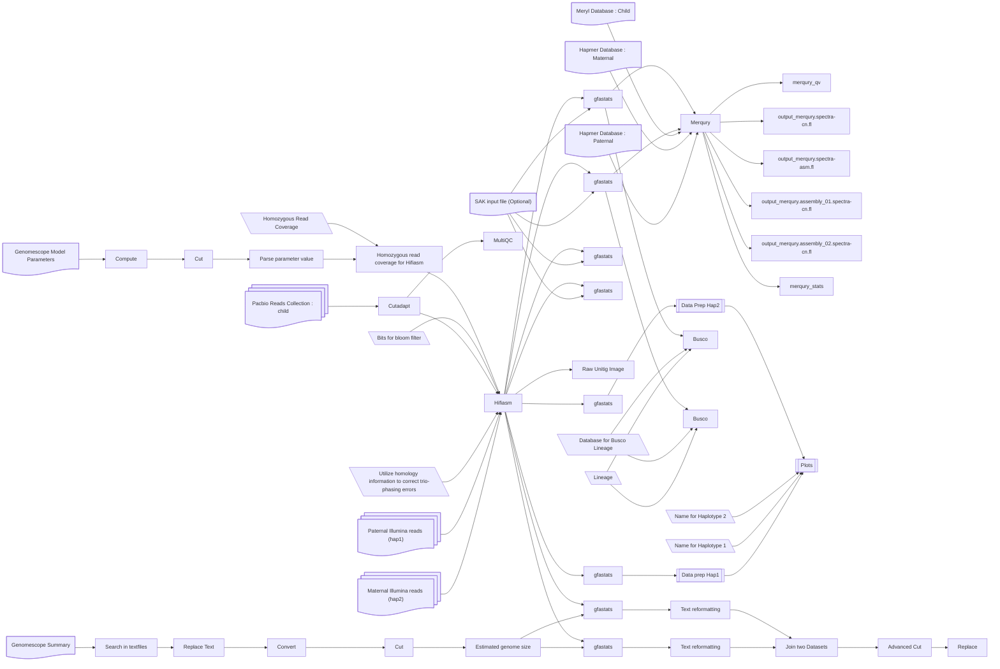
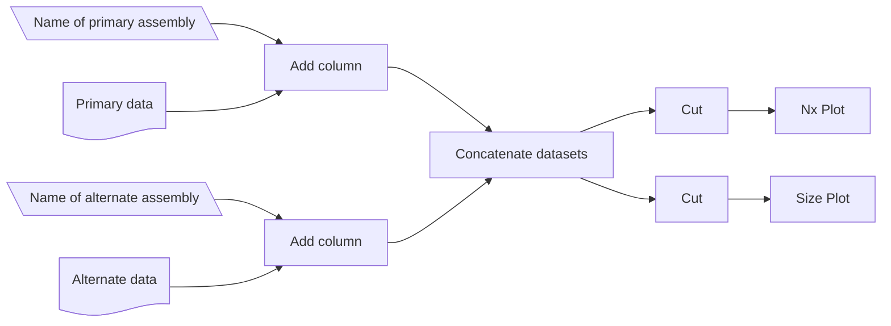
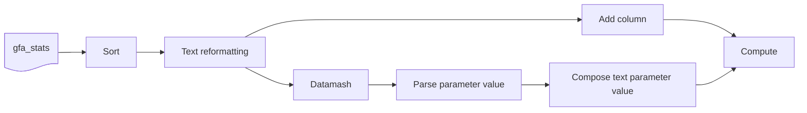

# Workflow diagrams

## Assembly-Hifi-Trio-phasing-VGP5

```mermaid
graph LR
0["Pacbio Reads Collection : child"]@{ shape: docs }
1["Paternal Illumina reads (hap1)"]@{ shape: docs }
2["Maternal Illumina reads (hap2)"]@{ shape: docs }
3["Meryl Database : Child"]@{ shape: doc }
4["Hapmer Database : Paternal"]@{ shape: doc }
5["Hapmer Database : Maternal"]@{ shape: doc }
6["Bits for bloom filter"]@{ shape: lean-l }
7["Database for Busco Lineage"]@{ shape: lean-l }
8["Lineage"]@{ shape: lean-l }
9["Homozygous Read Coverage"]@{ shape: lean-l }
10["Genomescope Model Parameters"]@{ shape: doc }
11["Genomescope Summary"]@{ shape: doc }
12["Utilize homology information to correct trio-phasing errors"]@{ shape: lean-l }
13["SAK input file (Optional)"]@{ shape: doc }
14["Name for Haplotype 1"]@{ shape: lean-l }
15["Name for Haplotype 2"]@{ shape: lean-l }
16["Cutadapt"]@{ shape: process }
0 --> 16
17["Compute"]@{ shape: process }
10 --> 17
18["Search in textfiles"]@{ shape: process }
11 --> 18
19["MultiQC"]@{ shape: process }
16 --> 19
20["Cut"]@{ shape: process }
17 --> 20
21["Replace Text"]@{ shape: process }
18 --> 21
22["Parse parameter value"]@{ shape: process }
20 --> 22
23["Convert"]@{ shape: process }
21 --> 23
24["Homozygous read coverage for Hifiasm"]@{ shape: process }
9 --> 24
22 --> 24
25["Cut"]@{ shape: process }
23 --> 25
26["Hifiasm"]@{ shape: process }
24 --> 26
6 --> 26
16 --> 26
12 --> 26
1 --> 26
2 --> 26
27["Estimated genome size"]@{ shape: process }
25 --> 27
28["gfastats"]@{ shape: process }
26 --> 28
13 --> 28
29["gfastats"]@{ shape: process }
26 --> 29
13 --> 29
30["Raw Unitig Image"]@{ shape: process }
26 --> 30
31["gfastats"]@{ shape: process }
26 --> 31
13 --> 31
32["gfastats"]@{ shape: process }
26 --> 32
13 --> 32
33["gfastats"]@{ shape: process }
26 --> 33
34["gfastats"]@{ shape: process }
26 --> 34
35["gfastats"]@{ shape: process }
26 --> 35
27 --> 35
36["gfastats"]@{ shape: process }
26 --> 36
27 --> 36
37["Busco"]@{ shape: process }
31 --> 37
7 --> 37
8 --> 37
38["Busco"]@{ shape: process }
32 --> 38
7 --> 38
8 --> 38
39["Merqury"]@{ shape: process }
31 --> 39
32 --> 39
3 --> 39
5 --> 39
4 --> 39
40["Data prep Hap1"]@{ shape: subprocess }
33 --> 40
41["Data Prep Hap2"]@{ shape: subprocess }
34 --> 41
42["Text reformatting"]@{ shape: process }
35 --> 42
43["Text reformatting"]@{ shape: process }
36 --> 43
44["merqury_qv"]@{ shape: process }
39 --> 44
45["output_merqury.spectra-cn.fl"]@{ shape: process }
39 --> 45
46["output_merqury.spectra-asm.fl"]@{ shape: process }
39 --> 46
47["output_merqury.assembly_01.spectra-cn.fl"]@{ shape: process }
39 --> 47
48["output_merqury.assembly_02.spectra-cn.fl"]@{ shape: process }
39 --> 48
49["merqury_stats"]@{ shape: process }
39 --> 49
50["Plots"]@{ shape: subprocess }
41 --> 50
15 --> 50
14 --> 50
40 --> 50
51["Join two Datasets"]@{ shape: process }
43 --> 51
42 --> 51
52["Advanced Cut"]@{ shape: process }
51 --> 52
53["Replace"]@{ shape: process }
52 --> 53
```

## gfastats_plot

```mermaid
graph LR
0["Primary data"]@{ shape: doc }
1["Alternate data"]@{ shape: doc }
2["Name of primary assembly"]@{ shape: lean-l }
3["Name of alternate assembly"]@{ shape: lean-l }
4["Add column"]@{ shape: process }
2 --> 4
0 --> 4
5["Add column"]@{ shape: process }
3 --> 5
1 --> 5
6["Concatenate datasets"]@{ shape: process }
4 --> 6
5 --> 6
7["Cut"]@{ shape: process }
6 --> 7
8["Cut"]@{ shape: process }
6 --> 8
9["Nx Plot"]@{ shape: process }
7 --> 9
10["Size Plot"]@{ shape: process }
8 --> 10
```

## gfastats_data_prep

```mermaid
graph LR
0["gfa_stats"]@{ shape: doc }
1["Sort"]@{ shape: process }
0 --> 1
2["Text reformatting"]@{ shape: process }
1 --> 2
3["Datamash"]@{ shape: process }
2 --> 3
4["Add column"]@{ shape: process }
2 --> 4
5["Parse parameter value"]@{ shape: process }
3 --> 5
6["Compose text parameter value"]@{ shape: process }
5 --> 6
7["Compute"]@{ shape: process }
4 --> 7
6 --> 7
```
