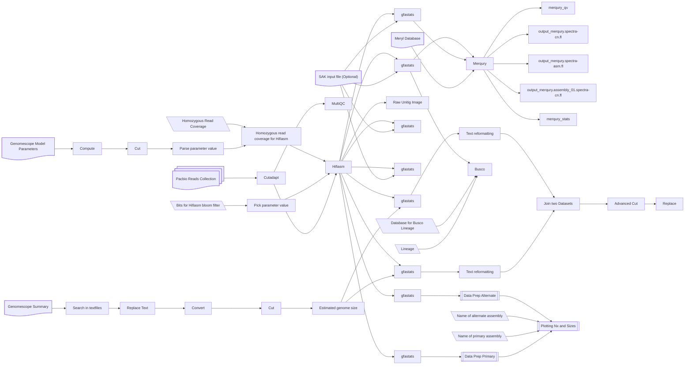
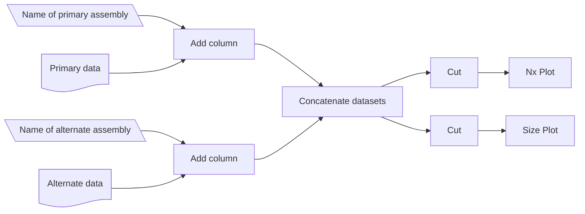
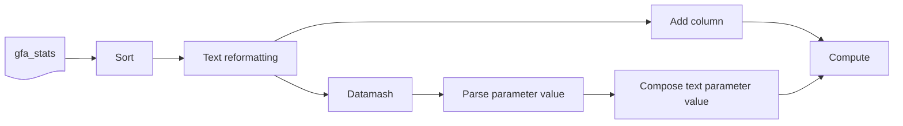

# Workflow diagrams

## Assembly-Hifi-only-VGP3

```mermaid
graph LR
0["Pacbio Reads Collection"]@{ shape: docs }
1["Meryl Database"]@{ shape: doc }
2["Genomescope Summary"]@{ shape: doc }
3["Bits for Hifiasm bloom filter"]@{ shape: lean-l }
4["Homozygous Read Coverage"]@{ shape: lean-l }
5["Genomescope Model Parameters"]@{ shape: doc }
6["Database for Busco Lineage"]@{ shape: lean-l }
7["Lineage"]@{ shape: lean-l }
8["SAK input file (Optional)"]@{ shape: doc }
9["Name of primary assembly"]@{ shape: lean-l }
10["Name of alternate assembly"]@{ shape: lean-l }
11["Cutadapt"]@{ shape: process }
0 --> 11
12["Search in textfiles"]@{ shape: process }
2 --> 12
13["Pick parameter value"]@{ shape: process }
3 --> 13
14["Compute"]@{ shape: process }
5 --> 14
15["MultiQC"]@{ shape: process }
11 --> 15
16["Replace Text"]@{ shape: process }
12 --> 16
17["Cut"]@{ shape: process }
14 --> 17
18["Convert"]@{ shape: process }
16 --> 18
19["Parse parameter value"]@{ shape: process }
17 --> 19
20["Cut"]@{ shape: process }
18 --> 20
21["Homozygous read coverage for Hifiasm"]@{ shape: process }
4 --> 21
19 --> 21
22["Estimated genome size"]@{ shape: process }
20 --> 22
23["Hifiasm"]@{ shape: process }
21 --> 23
13 --> 23
11 --> 23
24["Raw Unitig Image"]@{ shape: process }
23 --> 24
25["gfastats"]@{ shape: process }
23 --> 25
8 --> 25
26["gfastats"]@{ shape: process }
23 --> 26
8 --> 26
27["gfastats"]@{ shape: process }
23 --> 27
8 --> 27
28["gfastats"]@{ shape: process }
23 --> 28
8 --> 28
29["gfastats"]@{ shape: process }
23 --> 29
22 --> 29
30["gfastats"]@{ shape: process }
23 --> 30
22 --> 30
31["gfastats"]@{ shape: process }
23 --> 31
32["gfastats"]@{ shape: process }
23 --> 32
33["Busco"]@{ shape: process }
27 --> 33
6 --> 33
7 --> 33
34["Merqury"]@{ shape: process }
27 --> 34
28 --> 34
1 --> 34
35["Text reformatting"]@{ shape: process }
29 --> 35
36["Text reformatting"]@{ shape: process }
30 --> 36
37["Data Prep Primary"]@{ shape: subprocess }
31 --> 37
38["Data Prep Alternate"]@{ shape: subprocess }
32 --> 38
39["merqury_qv"]@{ shape: process }
34 --> 39
40["output_merqury.spectra-cn.fl"]@{ shape: process }
34 --> 40
41["output_merqury.spectra-asm.fl"]@{ shape: process }
34 --> 41
42["output_merqury.assembly_01.spectra-cn.fl"]@{ shape: process }
34 --> 42
43["merqury_stats"]@{ shape: process }
34 --> 43
44["Join two Datasets"]@{ shape: process }
35 --> 44
36 --> 44
45["Plotting Nx and Sizes"]@{ shape: subprocess }
38 --> 45
10 --> 45
9 --> 45
37 --> 45
46["Advanced Cut"]@{ shape: process }
44 --> 46
47["Replace"]@{ shape: process }
46 --> 47
```

## gfastats_plot

```mermaid
graph LR
0["Primary data"]@{ shape: doc }
1["Alternate data"]@{ shape: doc }
2["Name of primary assembly"]@{ shape: lean-l }
3["Name of alternate assembly"]@{ shape: lean-l }
4["Add column"]@{ shape: process }
2 --> 4
0 --> 4
5["Add column"]@{ shape: process }
3 --> 5
1 --> 5
6["Concatenate datasets"]@{ shape: process }
4 --> 6
5 --> 6
7["Cut"]@{ shape: process }
6 --> 7
8["Cut"]@{ shape: process }
6 --> 8
9["Nx Plot"]@{ shape: process }
7 --> 9
10["Size Plot"]@{ shape: process }
8 --> 10
```

## gfastats_data_prep

```mermaid
graph LR
0["gfa_stats"]@{ shape: doc }
1["Sort"]@{ shape: process }
0 --> 1
2["Text reformatting"]@{ shape: process }
1 --> 2
3["Datamash"]@{ shape: process }
2 --> 3
4["Add column"]@{ shape: process }
2 --> 4
5["Parse parameter value"]@{ shape: process }
3 --> 5
6["Compose text parameter value"]@{ shape: process }
5 --> 6
7["Compute"]@{ shape: process }
4 --> 7
6 --> 7
```
