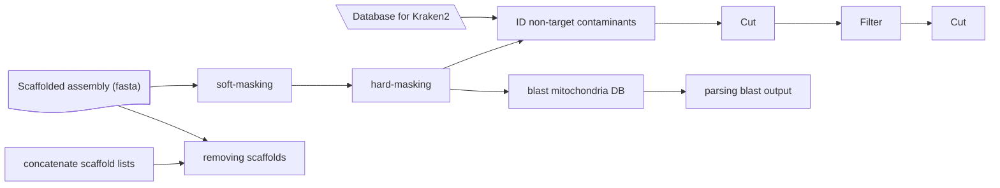

# Workflow diagrams

## Assembly-decontamination-VGP9

```mermaid
graph LR
0["Scaffolded assembly (fasta)"]@{ shape: doc }
1["Database for Kraken2"]@{ shape: lean-l }
2["soft-masking "]@{ shape: process }
0 --> 2
3["hard-masking"]@{ shape: process }
2 --> 3
4["ID non-target contaminants"]@{ shape: process }
1 --> 4
3 --> 4
5["blast mitochondria DB"]@{ shape: process }
3 --> 5
6["Cut"]@{ shape: process }
4 --> 6
7["parsing blast output"]@{ shape: process }
5 --> 7
8["Filter"]@{ shape: process }
6 --> 8
9["Cut"]@{ shape: process }
8 --> 9
10["concatenate scaffold lists"]@{ shape: process }
11["removing scaffolds "]@{ shape: process }
0 --> 11
10 --> 11
```
