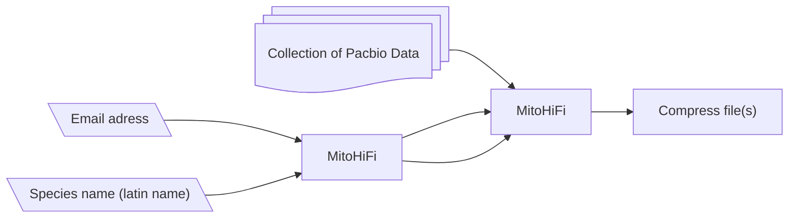

# Workflow diagrams

## Mitogenome-Assembly-VGP0

```mermaid
graph LR
0["Collection of Pacbio Data"]@{ shape: docs }
1["Species name (latin name)"]@{ shape: lean-l }
2["Email adress"]@{ shape: lean-l }
3["MitoHiFi"]@{ shape: process }
2 --> 3
1 --> 3
4["MitoHiFi"]@{ shape: process }
0 --> 4
3 --> 4
3 --> 4
5["Compress file(s)"]@{ shape: process }
4 --> 5
```
