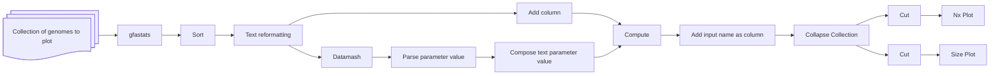

# Workflow diagrams

## Generate Nx and Size plots for multiple assemblies

```mermaid
graph LR
0["Collection of genomes to plot"]@{ shape: docs }
1["gfastats"]@{ shape: process }
0 --> 1
2["Sort"]@{ shape: process }
1 --> 2
3["Text reformatting"]@{ shape: process }
2 --> 3
4["Datamash"]@{ shape: process }
3 --> 4
5["Add column"]@{ shape: process }
3 --> 5
6["Parse parameter value"]@{ shape: process }
4 --> 6
7["Compose text parameter value"]@{ shape: process }
6 --> 7
8["Compute"]@{ shape: process }
5 --> 8
7 --> 8
9["Add input name as column"]@{ shape: process }
8 --> 9
10["Collapse Collection"]@{ shape: process }
9 --> 10
11["Cut"]@{ shape: process }
10 --> 11
12["Cut"]@{ shape: process }
10 --> 12
13["Nx Plot"]@{ shape: process }
11 --> 13
14["Size Plot"]@{ shape: process }
12 --> 14
```
