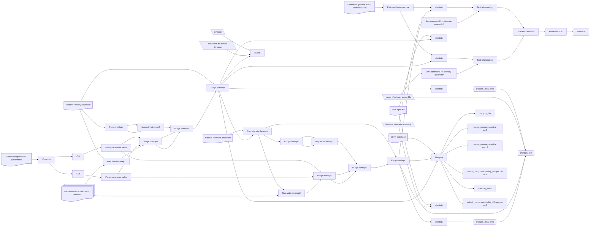
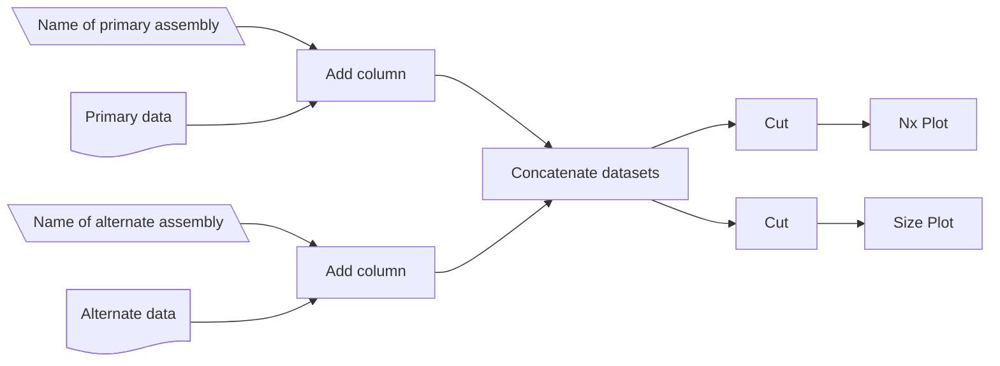
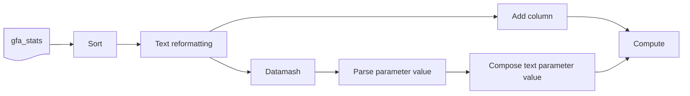

# Workflow diagrams

## Purge-duplicate-contigs-VGP6

```mermaid
graph LR
0["Pacbio Reads Collection - Trimmed"]@{ shape: docs }
1["Hifiasm Primary assembly"]@{ shape: doc }
2["Hifiasm Alternate assembly"]@{ shape: doc }
3["Meryl Database"]@{ shape: doc }
4["Genomescope model parameters"]@{ shape: doc }
5["Estimated genome size - Parameter File"]@{ shape: doc }
6["Database for Busco Lineage"]@{ shape: lean-l }
7["Lineage"]@{ shape: lean-l }
8["SAK input file"]@{ shape: doc }
9["Name of primary assembly"]@{ shape: lean-l }
10["Name of alternate assembly"]@{ shape: lean-l }
11["Map with minimap2"]@{ shape: process }
0 --> 11
1 --> 11
12["Purge overlaps"]@{ shape: process }
1 --> 12
13["Compute"]@{ shape: process }
4 --> 13
14["Estimated genome size"]@{ shape: process }
5 --> 14
15["Awk command for primary assembly"]@{ shape: process }
9 --> 15
16["Awk command for alternate assembly 2"]@{ shape: process }
10 --> 16
17["Map with minimap2"]@{ shape: process }
12 --> 17
12 --> 17
18["Cut"]@{ shape: process }
13 --> 18
19["Cut"]@{ shape: process }
13 --> 19
20["Parse parameter value"]@{ shape: process }
18 --> 20
21["Parse parameter value"]@{ shape: process }
19 --> 21
22["Purge overlaps"]@{ shape: process }
11 --> 22
21 --> 22
20 --> 22
23["Purge overlaps"]@{ shape: process }
22 --> 23
22 --> 23
17 --> 23
24["Purge overlaps"]@{ shape: process }
23 --> 24
1 --> 24
25["Concatenate datasets"]@{ shape: process }
24 --> 25
2 --> 25
26["Busco"]@{ shape: process }
24 --> 26
6 --> 26
7 --> 26
27["gfastats"]@{ shape: process }
24 --> 27
8 --> 27
28["gfastats"]@{ shape: process }
24 --> 28
14 --> 28
29["gfastats"]@{ shape: process }
24 --> 29
30["Map with minimap2"]@{ shape: process }
0 --> 30
25 --> 30
31["Purge overlaps"]@{ shape: process }
25 --> 31
32["Text reformatting"]@{ shape: process }
15 --> 32
28 --> 32
33["gfastats_data_prep"]@{ shape: subprocess }
29 --> 33
34["Purge overlaps"]@{ shape: process }
30 --> 34
21 --> 34
20 --> 34
35["Map with minimap2"]@{ shape: process }
31 --> 35
31 --> 35
36["Purge overlaps"]@{ shape: process }
34 --> 36
34 --> 36
35 --> 36
37["Purge overlaps"]@{ shape: process }
36 --> 37
25 --> 37
38["gfastats"]@{ shape: process }
37 --> 38
14 --> 38
39["gfastats"]@{ shape: process }
37 --> 39
40["Merqury"]@{ shape: process }
24 --> 40
37 --> 40
3 --> 40
41["gfastats"]@{ shape: process }
37 --> 41
8 --> 41
42["Text reformatting"]@{ shape: process }
16 --> 42
38 --> 42
43["gfastats_data_prep"]@{ shape: subprocess }
39 --> 43
44["merqury_QV"]@{ shape: process }
40 --> 44
45["output_merqury.spectra-cn.fl"]@{ shape: process }
40 --> 45
46["output_merqury.spectra-asm.fl"]@{ shape: process }
40 --> 46
47["output_merqury.assembly_01.spectra-cn.fl"]@{ shape: process }
40 --> 47
48["merqury_stats"]@{ shape: process }
40 --> 48
49["output_merqury.assembly_02.spectra-cn.fl"]@{ shape: process }
40 --> 49
50["Join two Datasets"]@{ shape: process }
32 --> 50
42 --> 50
51["gfastats_plot"]@{ shape: subprocess }
43 --> 51
10 --> 51
9 --> 51
33 --> 51
52["Advanced Cut"]@{ shape: process }
50 --> 52
53["Replace"]@{ shape: process }
52 --> 53
```

## gfastats_plot

```mermaid
graph LR
0["Primary data"]@{ shape: doc }
1["Alternate data"]@{ shape: doc }
2["Name of primary assembly"]@{ shape: lean-l }
3["Name of alternate assembly"]@{ shape: lean-l }
4["Add column"]@{ shape: process }
2 --> 4
0 --> 4
5["Add column"]@{ shape: process }
3 --> 5
1 --> 5
6["Concatenate datasets"]@{ shape: process }
4 --> 6
5 --> 6
7["Cut"]@{ shape: process }
6 --> 7
8["Cut"]@{ shape: process }
6 --> 8
9["Nx Plot"]@{ shape: process }
7 --> 9
10["Size Plot"]@{ shape: process }
8 --> 10
```

## gfastats_data_prep

```mermaid
graph LR
0["gfa_stats"]@{ shape: doc }
1["Sort"]@{ shape: process }
0 --> 1
2["Text reformatting"]@{ shape: process }
1 --> 2
3["Datamash"]@{ shape: process }
2 --> 3
4["Add column"]@{ shape: process }
2 --> 4
5["Parse parameter value"]@{ shape: process }
3 --> 5
6["Compose text parameter value"]@{ shape: process }
5 --> 6
7["Compute"]@{ shape: process }
4 --> 7
6 --> 7
```
