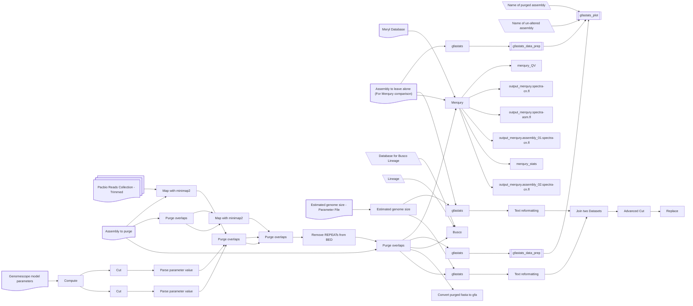
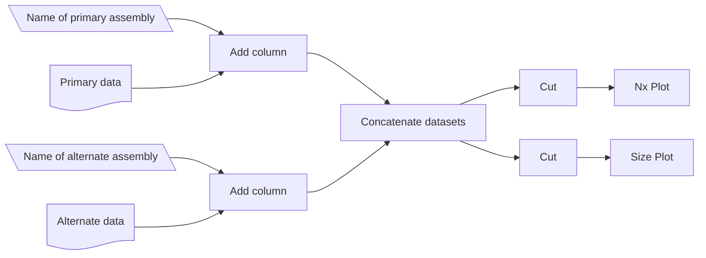
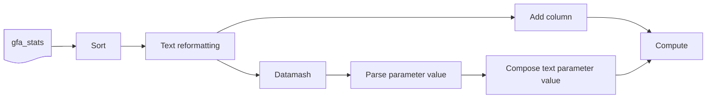

# Workflow diagrams

## Purging-duplicates-one-haplotype-VGP6b 

```mermaid
graph LR
0["Genomescope model parameters"]@{ shape: doc }
1["Pacbio Reads Collection - Trimmed"]@{ shape: docs }
2["Assembly to purge"]@{ shape: doc }
3["Meryl Database"]@{ shape: doc }
4["Assembly to leave alone (For Merqury comparison)"]@{ shape: doc }
5["Estimated genome size - Parameter File"]@{ shape: doc }
6["Database for Busco Lineage"]@{ shape: lean-l }
7["Lineage"]@{ shape: lean-l }
8["Name of purged assembly"]@{ shape: lean-l }
9["Name of un-altered assembly"]@{ shape: lean-l }
10["Compute"]@{ shape: process }
0 --> 10
11["Map with minimap2"]@{ shape: process }
1 --> 11
2 --> 11
12["Purge overlaps"]@{ shape: process }
2 --> 12
13["gfastats"]@{ shape: process }
4 --> 13
14["Estimated genome size"]@{ shape: process }
5 --> 14
15["Cut"]@{ shape: process }
10 --> 15
16["Cut"]@{ shape: process }
10 --> 16
17["Map with minimap2"]@{ shape: process }
12 --> 17
12 --> 17
18["gfastats_data_prep"]@{ shape: subprocess }
13 --> 18
19["gfastats"]@{ shape: process }
4 --> 19
14 --> 19
20["Parse parameter value"]@{ shape: process }
15 --> 20
21["Parse parameter value"]@{ shape: process }
16 --> 21
22["Text reformatting"]@{ shape: process }
19 --> 22
23["Purge overlaps"]@{ shape: process }
11 --> 23
21 --> 23
20 --> 23
24["Purge overlaps"]@{ shape: process }
23 --> 24
23 --> 24
17 --> 24
25["Remove REPEATs from BED"]@{ shape: process }
24 --> 25
26["Purge overlaps"]@{ shape: process }
25 --> 26
2 --> 26
27["Merqury"]@{ shape: process }
26 --> 27
4 --> 27
3 --> 27
28["gfastats"]@{ shape: process }
26 --> 28
29["Busco"]@{ shape: process }
26 --> 29
6 --> 29
7 --> 29
30["Convert purged fasta to gfa"]@{ shape: process }
26 --> 30
31["gfastats"]@{ shape: process }
26 --> 31
14 --> 31
32["merqury_QV"]@{ shape: process }
27 --> 32
33["output_merqury.spectra-cn.fl"]@{ shape: process }
27 --> 33
34["output_merqury.spectra-asm.fl"]@{ shape: process }
27 --> 34
35["output_merqury.assembly_01.spectra-cn.fl"]@{ shape: process }
27 --> 35
36["merqury_stats"]@{ shape: process }
27 --> 36
37["output_merqury.assembly_02.spectra-cn.fl"]@{ shape: process }
27 --> 37
38["gfastats_data_prep"]@{ shape: subprocess }
28 --> 38
39["Text reformatting"]@{ shape: process }
31 --> 39
40["gfastats_plot"]@{ shape: subprocess }
18 --> 40
9 --> 40
8 --> 40
38 --> 40
41["Join two Datasets"]@{ shape: process }
39 --> 41
22 --> 41
42["Advanced Cut"]@{ shape: process }
41 --> 42
43["Replace"]@{ shape: process }
42 --> 43
```

## gfastats_plot

```mermaid
graph LR
0["Primary data"]@{ shape: doc }
1["Alternate data"]@{ shape: doc }
2["Name of primary assembly"]@{ shape: lean-l }
3["Name of alternate assembly"]@{ shape: lean-l }
4["Add column"]@{ shape: process }
2 --> 4
0 --> 4
5["Add column"]@{ shape: process }
3 --> 5
1 --> 5
6["Concatenate datasets"]@{ shape: process }
4 --> 6
5 --> 6
7["Cut"]@{ shape: process }
6 --> 7
8["Cut"]@{ shape: process }
6 --> 8
9["Nx Plot"]@{ shape: process }
7 --> 9
10["Size Plot"]@{ shape: process }
8 --> 10
```

## gfastats_data_prep

```mermaid
graph LR
0["gfa_stats"]@{ shape: doc }
1["Sort"]@{ shape: process }
0 --> 1
2["Text reformatting"]@{ shape: process }
1 --> 2
3["Datamash"]@{ shape: process }
2 --> 3
4["Add column"]@{ shape: process }
2 --> 4
5["Parse parameter value"]@{ shape: process }
3 --> 5
6["Compose text parameter value"]@{ shape: process }
5 --> 6
7["Compute"]@{ shape: process }
4 --> 7
6 --> 7
```
