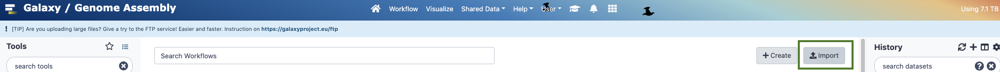
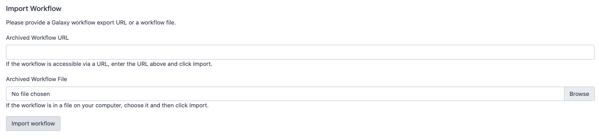
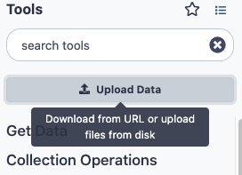
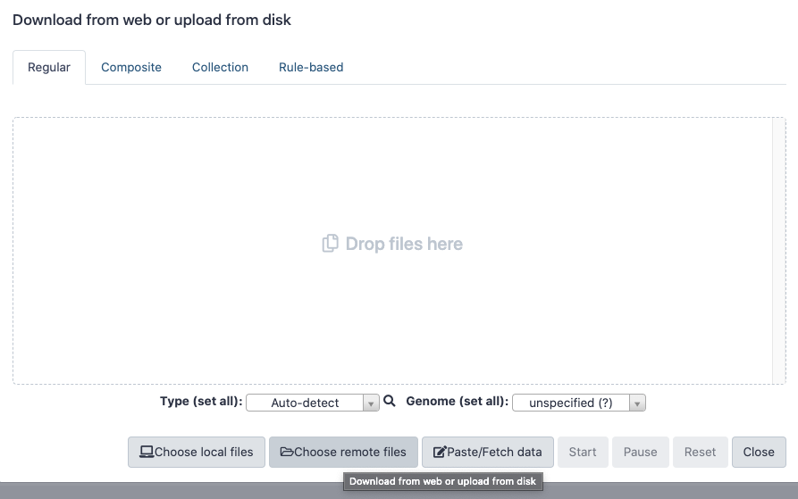
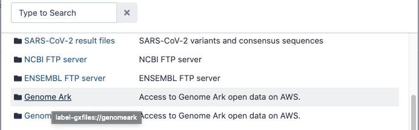
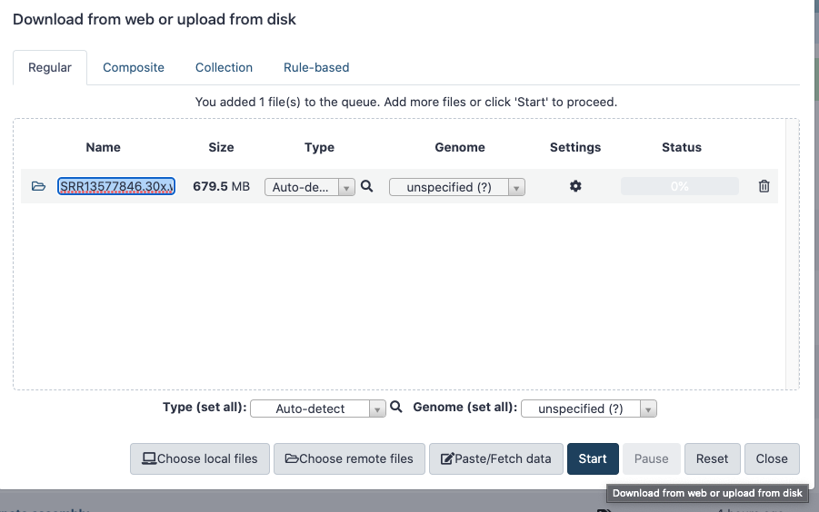
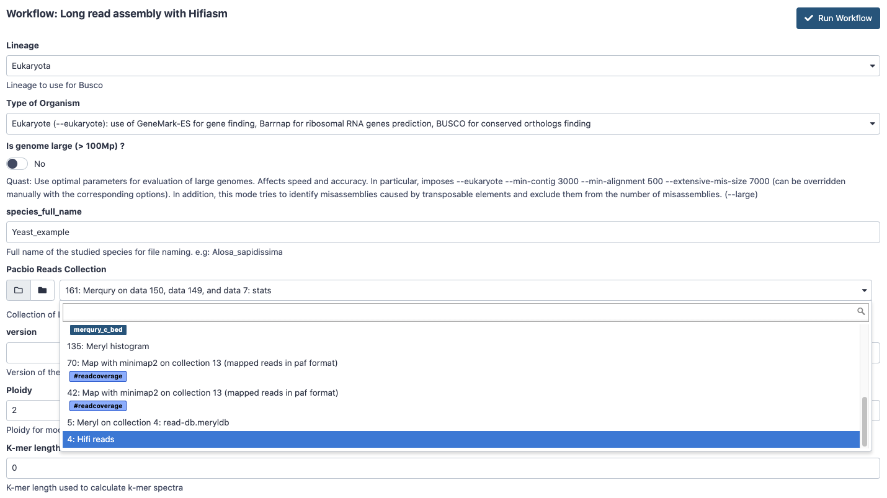

# Vertebrate Genome Project in Galaxy

### The Vertebrate Genome Project (VGP)

This repository hosts the Galaxy workflows for the Vertebrate Genome Project's assembly pipeline. Each workflow's *.ga* file can be found in the folder with the corresponding name. For more information about the pipeline in general and the software/technologies used by the VGP for assembly, please see this [full-length GTN training tutorial](https://training.galaxyproject.org/training-material//topics/assembly/tutorials/vgp_genome_assembly/tutorial.html). For a shorter, workflow-focused tutorial, please see this [shortened GTN training tutorial](https://training.galaxyproject.org/training-material/topics/assembly/tutorials/vgp_workflow_training/tutorial.html). 

## Usage

Workflows currently available on the [Galaxy genome assembly](https://assembly.usegalaxy.eu/) instance.

### Import workflows to Galaxy

> Note : You need to be a registered user in a Galaxy instance to use workflows.

To import the VGP workflows into Galaxy, download the `.ga` files on your computer from this github repository.

1.  Go to the `Workflow` tab in Galaxy

2.  Select `Import` 
3.  Click on `Browse` and select the `.ga` file on your computer 
4.  Click on `Import Workflow`

### Import data from the VGP repository

> Note : learn about data upload in Galaxy with the [Galaxy training network (GTN)](https://training.galaxyproject.org/training-material/topics/galaxy-interface/)

1.  On the left tool panel, click on `Upload Data`   
2.  Select `Choose remote files`   
3.  Explore the *Genome Ark* repository for the data you want 
4.  Select the datasets to upload and click `Ok`
5.  Start the upload 

### Run workflows

The VGP pipeline is composed of :
-   Five main workflows
    1. Quality control and parameter estimation. It provides a kmer coverage database and an estimation of parameters that will be useful in the genome assembly process.
    2. Phased assembly with Hifiasm
    3. Purging of duplications and overlap from the phased assembly
    4. Scafolding using Bionano optical mapping (optional)
    5. Scafolding using HiC data
-   Two secondary workflows to correct the assembly purging by using custom cutoffs
   - Custom Purging of duplications and overlap from the primary assembly
   - Custom Purging of duplications and overlap from the alternate assembly
-   Four export workflows to AWS VGP repository
   - Phased assembly export
   - Purged assembly export
   - Bionano scaffolding export
   - HiC Scafolding export

> Note: For more details about the workflows steps by steps, which parameters to use, and how to understand the results, read our
[VGP assembly pipeline tutorial](https://training.galaxyproject.org/training-material//topics/assembly/tutorials/vgp_genome_assembly/tutorial.html)

To run a workflow:
1.  Go to the `Workflow` tab in Galaxy
2.  Click on the arrow next to the desired workflow 
3. Fill the tool form with the desired parameters and Inputs 
4. Click on `Run Workflow`

## Pseudohaplotype assembly (primary/alternate) assembly with hifiasm and purge_dups

***NOTE:*** see section after this for hifiasm instructions if you are doing **phased assembly in hifiasm using HiC reads (hap1/hap2), or phased assembly in hifiasm using parental reads (trio assembly)!** 

### VGP-Meryldb-creation (quality control and parameter estimation)

:arrow_right: :computer: **Inputs**

- HiFi reads (as a collection)

> Note: Learn about collections with the [Using dataset collections](https://training.galaxyproject.org/training-material/topics/galaxy-interface/tutorials/collections/tutorial.html) tutorial.

:computer: :arrow_right: **Outputs**

- Meryl database of kmer counts
- GenomeScope plots (linear, log, transformed linear, transformed log), summary, model parameters

### VGP-Hifiasm (assembly using long reads)

:arrow_right: :computer: **Inputs**
- HiFi reads (as a collection)
- Meryl database (from **Meryl Database Creation** workflow)

:computer: :arrow_right: **Outputs**
- Primary assembly (as .gfa and as .fasta) [c1]
- Alternate assembly (as .gfa and as .fasta) [c2]
- HiFi reads with reads containing adapter sequence removed (as a collection) [trimmed]

:bar_chart: **Quality control**
- BUSCO for primary assembly [c1]
- QUAST for primary and alternate assembly [c1, c2]
- Merqury files (as collections) for primary and alternate assembly [c]
    - plots (spectra-cn, spectra-asm, assembly01 spectra-cn, assembly02 spectra-cn)
    - stats (completeness)
    - QV stats

### VGP-Purge-assembly (purge dups)

:arrow_right: :computer: **Inputs**
- Primary assembly [c1]
- Alternate assembly [c2]
- Genomescope model parameters (from **Meryl Database Creation** workflow) [genomescope_params]
- Estimated genome size (from **Hifiasm** workflow) [estimated_genome_size]
- *trimmed* HiFi reads (from **Hifiasm** workflow) (as a collection) [trimmed]

:computer: :arrow_right: **Outputs**
- Purged primary assembly [p1]
    - the sequences which were purged from the primary [seq_purged_p1]
- Purged alternate assembly [p2]
    - the sequences which were purged from the alternate [seq_purged_p2]
- Purge_dups intermediates (for primary and alternate)
    - coverage [depths]
    - PBCSTAT base coverage  [calcuts_basecov]
    - PBCSTAT base coverage (as .wig) [calcuts_basecov_wig]
    - histogram plot [calcuts_hist]
    - calcuts log [calcuts_log]
    - calcuts cutoff [calcuts_cutoffs]
    - purge_dups regions (as .bed) [purgeoverlap_bed]

:bar_chart: **Quality Control**
- BUSCO for purged primary assembly [p1]
- QUAST for purged primary and purged alternate assembly [p1, p2]
- Merqury files (as collections) for purged primary and alternate assembly [p]
    - plots
    - completeness stats
    - QV stats

### Scaffolding with Bionano optical maps

:arrow_right: :computer: **Inputs**
- Purged primary assembly [p1]
- Bionano optical map (.cmap file)
- Estimated genome size (from **Hifiasm** workflow) [estimated_genome_size]
- **(OPTIONAL)** Conflict resolution file
    - can be used if one has previously run bionano scaffolding to obtain a conflicts file

:computer: :arrow_right: **Outputs**
- Complete s1 assembly: bionano hybrid scaffolds + contigs that didn't get scaffolded [complete_s1]
- Bionano hybrid scaffolds [scaffolded_s1]
- Contigs that didn't get scaffolded [non_scaffolded_s1]
- Hybrid scaffold report [s1_report]
- Conflicts [s1_conflicts]
- AGP file [s1_agp]

:bar_chart: **Quality Control**
- QUAST [s1]

### Scaffolding with HiC

:arrow_right: :computer: **Inputs**
- Scaffolded assembly from **Bionano workflow** [s1]
    - OR if you do not have bionano data: purged primary assembly from **purge_dups workflow** [p1]
- HiC forward reads (R1)
    - NOTE: if you have multiple .fastq.gz files of R1 reads, then you must concatenate them into one .fastq.gz
- HiC reverse reads (R2)
    - NOTE: if you have multiple .fastq.gz files of R2 reads, then you must concatenate them into one .fastq.gz. The reads must be in the same order as the concatenated R1 reads!
- Restriction enzyme sequences (typically `re_bases.txt` in GenomeArk)
- Estimated genome size (from **Hifiasm** workflow) [estimated_genome_size]
- **(OPTIONAL)** Sequence graph (as .gfa)

:computer: :arrow_right: **Outputs**
- HiC scaffolded assembly [s2]
    - this is the final primary assembly
- AGP file [s2]

:bar_chart: **Quality Control**
- QUAST [s2]
- BUSCO [s2]
- PretextMap for pre-HiC-scaffolding assembly [s1]
- PretextMap for post-HiC-scaffolding assembly [s2]
- PretextSnapshot for pre- & post-HiC-scaffolding assembly [s1, s2]
- Merged alignments for pre- & post-HiC-scaffolding assembly [merged_alignments]
- Sorted & merged alignments for pre- & post-HiC-scaffolding assembly [sorted_merged_alignments]

## Phased assembly (hap1/hap2) in hifiasm using long reads and HiC reads

This approach uses hifiasm with HiC integration in order to phase haplotypes into two haplotypes that are more complete compared to generating primary/alternate assemblies. This requires the usage of a different hifiasm workflow, which uses the HiC reads. The meryl workflow will be the same. The bionano & HiC-scaffolding workflows are also the same, but will be ran twice: once on each haplotype.

To sum up the differences:
- Meryl DB: the same
- Hifiasm: use the **Hifiasm HiC assembly** workflow instead!
- Bionano & HiC-scaffolding: same workflows, but run once on hap1, and once on hap2

### Hifiasm HiC assembly
:arrow_right: :computer: **Inputs**
- Meryl database (from **Meryl Database Creation** workflow)
- HiC forward reads (R1)
    - NOTE: if you have multiple .fastq.gz files of R1 reads, then you must concatenate them into one .fastq.gz
- HiC reverse reads (R2)
    - NOTE: if you have multiple .fastq.gz files of R2 reads, then you must concatenate them into one .fastq.gz. The reads must be in the same order as the concatenated R1 reads!
- HiFi reads (as a collection)

:computer: :arrow_right: **Outputs**
- Hap1 assembly (as .gfa and .fasta) [hap1]
- Hap2 assembly (as .gfa and .fasta) [hap2]

:bar_chart: **Quality Control**
- BUSCO for purged primary assembly [hap1, hap2]
- QUAST for purged primary and purged alternate assembly [hap1, hap2]
- Merqury files (as collections) for purged primary and alternate assembly [hic_phased]
    - plots
    - completeness stats
    - QV stats

## Trio-based assembly (mat/pat) in hifiasm using long reads and parental data

This approach uses hifiasm in trio mode in order to phase the data into maternal and paternal haplotypes, based on parental reads (usually Illumina short reads). This requires the usage of a different hifiasm workflow, as well as a different MerylDB workflow, which generates additional quality control and necessary files for the parental data. As with HiC-phased assembly, the bionano & HiC-scaffolding workflows will be the same, but ran once per haplotype.

To sum up the differences: 
- Meryl DB: use the **MerylDB trio** workflow instead!
- Hifiasm: use the **Hifiasm trio** workflow instead!
- Bionano & HiC-scaffolding: same workflows, but run once on hap1, and once on hap2

### MerylDB trio
:arrow_right: :computer: **Inputs**
- Parent 1 data as a collection of paired reads
> Note: see 
- Parent 2 data as a collection of paired reads

### Hifiasm trio assembly
:arrow_right: :computer: **Inputs**
- Meryl database (from **Meryl Database Creation** workflow)
- HiC forward reads (R1)
    - NOTE: if you have multiple .fastq.gz files of R1 reads, then you must concatenate them into one .fastq.gz
- HiC reverse reads (R2)
    - NOTE: if you have multiple .fastq.gz files of R2 reads, then you must concatenate them into one .fastq.gz. The reads must be in the same order as the concatenated R1 reads!
- HiFi reads (as a collection)

:computer: :arrow_right: **Outputs**
- Hap1 assembly (as .gfa and .fasta) [hap1]
- Hap2 assembly (as .gfa and .fasta) [hap2]

:bar_chart: **Quality Control**
- BUSCO for purged primary assembly [hap1, hap2]
- QUAST for purged primary and purged alternate assembly [hap1, hap2]
- Merqury files (as collections) for purged primary and alternate assembly [hic_phased]
    - plots
    - completeness stats
    - QV stats

## Export Workflows

to-do!