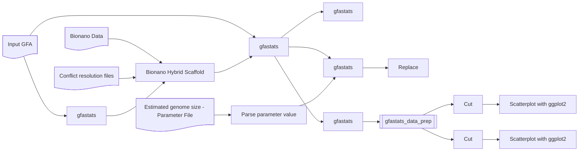
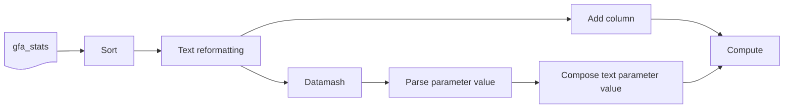

# Workflow diagrams

## Scaffolding-BioNano-VGP7

```mermaid
graph LR
0["Bionano Data"]@{ shape: doc }
1["Estimated genome size - Parameter File"]@{ shape: doc }
2["Input GFA"]@{ shape: doc }
3["Conflict resolution files"]@{ shape: doc }
4["Parse parameter value"]@{ shape: process }
1 --> 4
5["gfastats"]@{ shape: process }
2 --> 5
6["Bionano Hybrid Scaffold"]@{ shape: process }
0 --> 6
3 --> 6
5 --> 6
7["gfastats"]@{ shape: process }
2 --> 7
6 --> 7
8["gfastats"]@{ shape: process }
7 --> 8
9["gfastats"]@{ shape: process }
7 --> 9
4 --> 9
10["gfastats"]@{ shape: process }
7 --> 10
11["Replace"]@{ shape: process }
9 --> 11
12["gfastats_data_prep"]@{ shape: subprocess }
10 --> 12
13["Cut"]@{ shape: process }
12 --> 13
14["Cut"]@{ shape: process }
12 --> 14
15["Scatterplot with ggplot2"]@{ shape: process }
13 --> 15
16["Scatterplot with ggplot2"]@{ shape: process }
14 --> 16
```

## gfastats_data_prep

```mermaid
graph LR
0["gfa_stats"]@{ shape: doc }
1["Sort"]@{ shape: process }
0 --> 1
2["Text reformatting"]@{ shape: process }
1 --> 2
3["Datamash"]@{ shape: process }
2 --> 3
4["Add column"]@{ shape: process }
2 --> 4
5["Parse parameter value"]@{ shape: process }
3 --> 5
6["Compose text parameter value"]@{ shape: process }
5 --> 6
7["Compute"]@{ shape: process }
4 --> 7
6 --> 7
```
