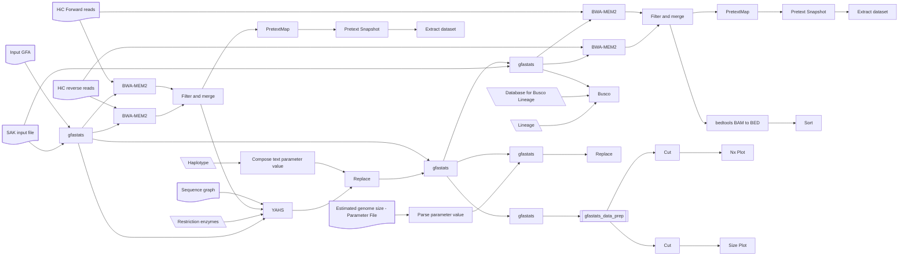
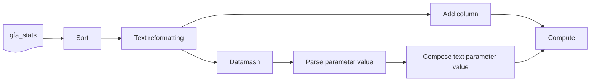

# Workflow diagrams

## Scaffolding with Hi-C data VGP8

```mermaid
graph LR
0["Input GFA"]@{ shape: doc }
1["Haplotype"]@{ shape: lean-l }
2["Sequence graph"]@{ shape: doc }
3["Database for Busco Lineage"]@{ shape: lean-l }
4["Lineage"]@{ shape: lean-l }
5["HiC Forward reads"]@{ shape: doc }
6["HiC reverse reads"]@{ shape: doc }
7["Restriction enzymes"]@{ shape: lean-l }
8["Estimated genome size - Parameter File"]@{ shape: doc }
9["SAK input file"]@{ shape: doc }
10["Compose text parameter value"]@{ shape: process }
1 --> 10
11["Parse parameter value"]@{ shape: process }
8 --> 11
12["gfastats"]@{ shape: process }
0 --> 12
9 --> 12
13["BWA-MEM2"]@{ shape: process }
5 --> 13
12 --> 13
14["BWA-MEM2"]@{ shape: process }
6 --> 14
12 --> 14
15["Filter and merge"]@{ shape: process }
13 --> 15
14 --> 15
16["PretextMap"]@{ shape: process }
15 --> 16
17["YAHS"]@{ shape: process }
2 --> 17
15 --> 17
7 --> 17
12 --> 17
18["Pretext Snapshot"]@{ shape: process }
16 --> 18
19["Replace"]@{ shape: process }
10 --> 19
17 --> 19
20["Extract dataset"]@{ shape: process }
18 --> 20
21["gfastats"]@{ shape: process }
12 --> 21
19 --> 21
22["gfastats"]@{ shape: process }
21 --> 22
9 --> 22
23["gfastats"]@{ shape: process }
21 --> 23
11 --> 23
24["gfastats"]@{ shape: process }
21 --> 24
25["BWA-MEM2"]@{ shape: process }
5 --> 25
22 --> 25
26["BWA-MEM2"]@{ shape: process }
6 --> 26
22 --> 26
27["Busco"]@{ shape: process }
22 --> 27
3 --> 27
4 --> 27
28["Replace"]@{ shape: process }
23 --> 28
29["gfastats_data_prep"]@{ shape: subprocess }
24 --> 29
30["Filter and merge"]@{ shape: process }
25 --> 30
26 --> 30
31["Cut"]@{ shape: process }
29 --> 31
32["Cut"]@{ shape: process }
29 --> 32
33["PretextMap"]@{ shape: process }
30 --> 33
34["bedtools BAM to BED"]@{ shape: process }
30 --> 34
35["Nx Plot"]@{ shape: process }
31 --> 35
36["Size Plot"]@{ shape: process }
32 --> 36
37["Pretext Snapshot"]@{ shape: process }
33 --> 37
38["Sort"]@{ shape: process }
34 --> 38
39["Extract dataset"]@{ shape: process }
37 --> 39
```

## gfastats_data_prep

```mermaid
graph LR
0["gfa_stats"]@{ shape: doc }
1["Sort"]@{ shape: process }
0 --> 1
2["Text reformatting"]@{ shape: process }
1 --> 2
3["Datamash"]@{ shape: process }
2 --> 3
4["Add column"]@{ shape: process }
2 --> 4
5["Parse parameter value"]@{ shape: process }
3 --> 5
6["Compose text parameter value"]@{ shape: process }
5 --> 6
7["Compute"]@{ shape: process }
4 --> 7
6 --> 7
```
