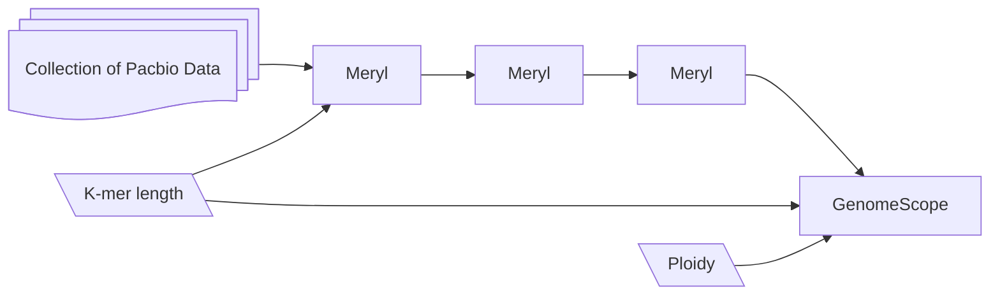

# Workflow diagrams

## kmer-profiling-hifi-VGP1

```mermaid
graph LR
0["Collection of Pacbio Data"]@{ shape: docs }
1["K-mer length "]@{ shape: lean-l }
2["Ploidy"]@{ shape: lean-l }
3["Meryl"]@{ shape: process }
0 --> 3
1 --> 3
4["Meryl"]@{ shape: process }
3 --> 4
5["Meryl"]@{ shape: process }
4 --> 5
6["GenomeScope"]@{ shape: process }
5 --> 6
1 --> 6
2 --> 6
```
