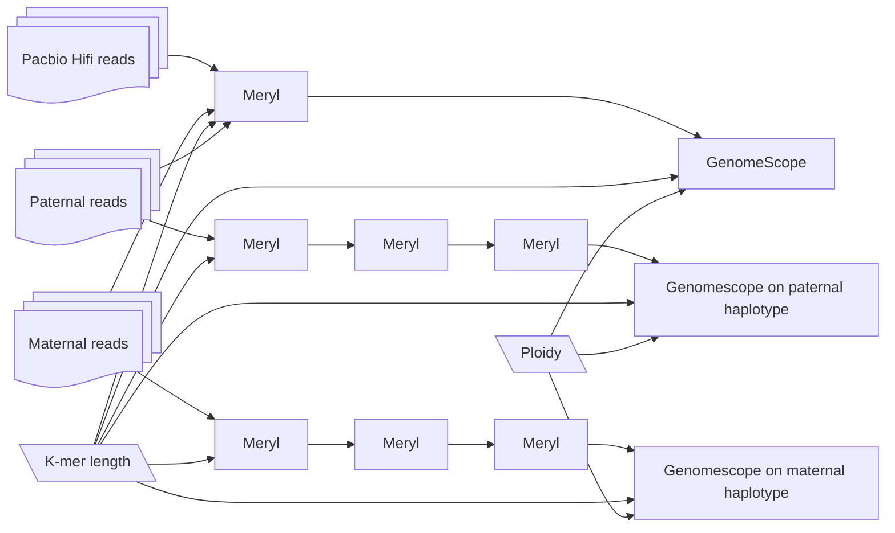

# Workflow diagrams

## kmer-profiling-hifi-trio-VGP2

```mermaid
graph LR
0["Pacbio Hifi reads"]@{ shape: docs }
1["Paternal reads"]@{ shape: docs }
2["Maternal reads"]@{ shape: docs }
3["K-mer length"]@{ shape: lean-l }
4["Ploidy"]@{ shape: lean-l }
5["Meryl"]@{ shape: process }
1 --> 5
3 --> 5
6["Meryl"]@{ shape: process }
0 --> 6
2 --> 6
3 --> 6
1 --> 6
7["Meryl"]@{ shape: process }
2 --> 7
3 --> 7
8["Meryl"]@{ shape: process }
5 --> 8
9["GenomeScope"]@{ shape: process }
6 --> 9
3 --> 9
4 --> 9
10["Meryl"]@{ shape: process }
7 --> 10
11["Meryl"]@{ shape: process }
8 --> 11
12["Meryl"]@{ shape: process }
10 --> 12
13["Genomescope on paternal haplotype"]@{ shape: process }
11 --> 13
3 --> 13
4 --> 13
14["Genomescope on maternal haplotype"]@{ shape: process }
12 --> 14
3 --> 14
4 --> 14
```
