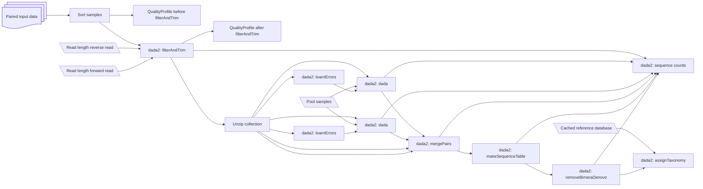

# Workflow diagrams

## dada2 amplicon analysis pipeline - for paired end data

```mermaid
graph LR
0["Paired input data"]@{ shape: docs }
1["Read length forward read"]@{ shape: lean-l }
2["Read length reverse read"]@{ shape: lean-l }
3["Pool samples"]@{ shape: lean-l }
4["Cached reference database"]@{ shape: lean-l }
5["Sort samples"]@{ shape: process }
0 --> 5
6["QualityProfile before filterAndTrim"]@{ shape: process }
5 --> 6
7["dada2: filterAndTrim"]@{ shape: process }
5 --> 7
2 --> 7
1 --> 7
8["QualityProfile after filterAndTrim"]@{ shape: process }
7 --> 8
9["Unzip collection"]@{ shape: process }
7 --> 9
10["dada2: learnErrors"]@{ shape: process }
9 --> 10
11["dada2: learnErrors"]@{ shape: process }
9 --> 11
12["dada2: dada"]@{ shape: process }
9 --> 12
3 --> 12
10 --> 12
13["dada2: dada"]@{ shape: process }
9 --> 13
3 --> 13
11 --> 13
14["dada2: mergePairs"]@{ shape: process }
12 --> 14
13 --> 14
9 --> 14
9 --> 14
15["dada2: makeSequenceTable"]@{ shape: process }
14 --> 15
16["dada2: removeBimeraDenovo"]@{ shape: process }
15 --> 16
17["dada2: sequence counts"]@{ shape: process }
7 --> 17
12 --> 17
13 --> 17
14 --> 17
15 --> 17
16 --> 17
18["dada2: assignTaxonomy"]@{ shape: process }
4 --> 18
16 --> 18
```
