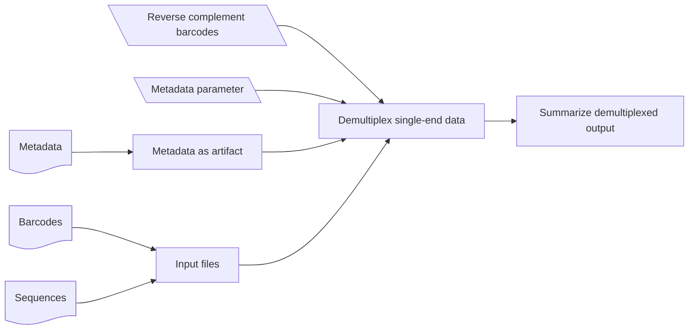

# Workflow diagrams

## QIIME2 Ia: multiplexed data (single-end)

```mermaid
graph LR
0["Sequences"]@{ shape: doc }
1["Barcodes"]@{ shape: doc }
2["Metadata"]@{ shape: doc }
3["Metadata parameter"]@{ shape: lean-l }
4["Reverse complement barcodes"]@{ shape: lean-l }
5["Input files"]@{ shape: process }
1 --> 5
0 --> 5
6["Metadata as artifact"]@{ shape: process }
2 --> 6
7["Demultiplex single-end data"]@{ shape: process }
4 --> 7
3 --> 7
6 --> 7
5 --> 7
8["Summarize demultiplexed output"]@{ shape: process }
7 --> 8
```
