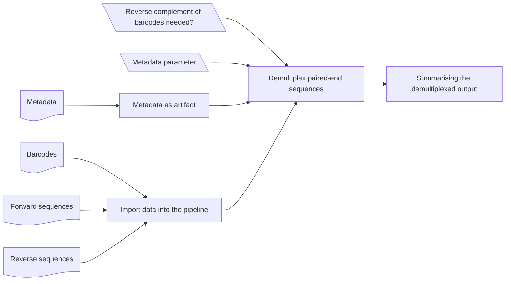

# Workflow diagrams

## QIIME2 Ib: multiplexed data (paired-end)

```mermaid
graph LR
0["Forward sequences"]@{ shape: doc }
1["Reverse sequences"]@{ shape: doc }
2["Barcodes"]@{ shape: doc }
3["Metadata"]@{ shape: doc }
4["Metadata parameter"]@{ shape: lean-l }
5["Reverse complement of barcodes needed?"]@{ shape: lean-l }
6["Import data into the pipeline"]@{ shape: process }
2 --> 6
0 --> 6
1 --> 6
7["Metadata as artifact"]@{ shape: process }
3 --> 7
8["Demultiplex paired-end sequences"]@{ shape: process }
5 --> 8
4 --> 8
7 --> 8
6 --> 8
9["Summarising the demultiplexed output"]@{ shape: process }
8 --> 9
```
