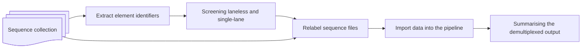

# Workflow diagrams

## QIIME2 Ic: Demultiplexed data (single-end)

```mermaid
graph LR
0["Sequence collection"]@{ shape: docs }
1["Extract element identifiers"]@{ shape: process }
0 --> 1
2["Screening laneless and single-lane"]@{ shape: process }
1 --> 2
3["Relabel sequence files"]@{ shape: process }
2 --> 3
0 --> 3
4["Import data into the pipeline"]@{ shape: process }
3 --> 4
5["Summarising the demultiplexed output"]@{ shape: process }
4 --> 5
```
