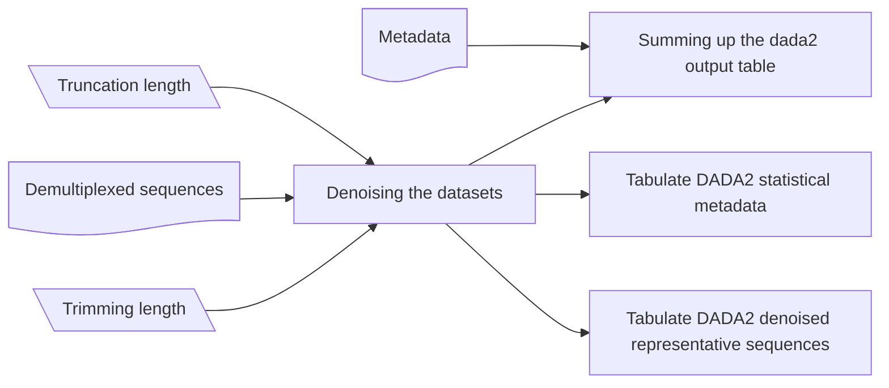

# Workflow diagrams

## QIIME2 IIa: Denoising (sequence quality control) and feature table creation (single-end)

```mermaid
graph LR
0["Metadata"]@{ shape: doc }
1["Demultiplexed sequences"]@{ shape: doc }
2["Truncation length"]@{ shape: lean-l }
3["Trimming length"]@{ shape: lean-l }
4["Denoising the datasets"]@{ shape: process }
3 --> 4
1 --> 4
2 --> 4
5["Tabulate DADA2 denoised representative sequences"]@{ shape: process }
4 --> 5
6["Tabulate DADA2 statistical metadata "]@{ shape: process }
4 --> 6
7["Summing up the dada2 output table"]@{ shape: process }
0 --> 7
4 --> 7
```
