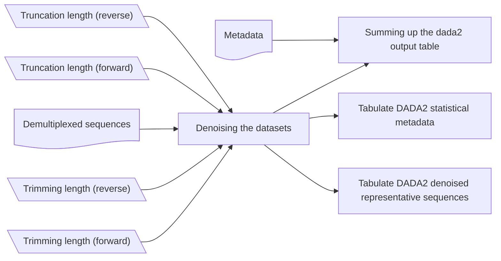

# Workflow diagrams

## QIIME2 IIb: Denoising (sequence quality control) and feature table creation (paired-end)

```mermaid
graph LR
0["Metadata"]@{ shape: doc }
1["Demultiplexed sequences"]@{ shape: doc }
2["Truncation length (forward)"]@{ shape: lean-l }
3["Truncation length (reverse)"]@{ shape: lean-l }
4["Trimming length (forward)"]@{ shape: lean-l }
5["Trimming length (reverse)"]@{ shape: lean-l }
6["Denoising the datasets"]@{ shape: process }
4 --> 6
5 --> 6
1 --> 6
2 --> 6
3 --> 6
7["Tabulate DADA2 denoised representative sequences"]@{ shape: process }
6 --> 7
8["Tabulate DADA2 statistical metadata "]@{ shape: process }
6 --> 8
9["Summing up the dada2 output table"]@{ shape: process }
0 --> 9
6 --> 9
```
