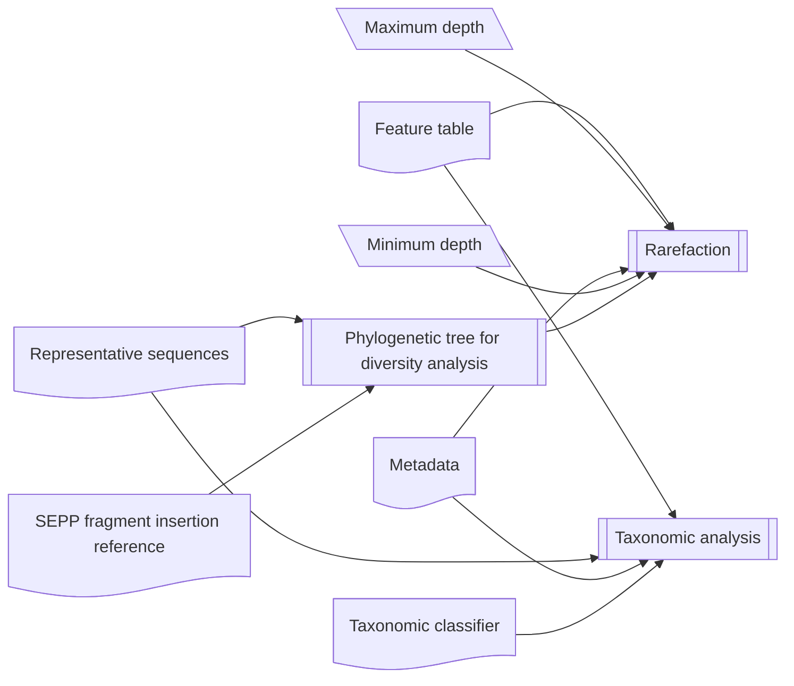
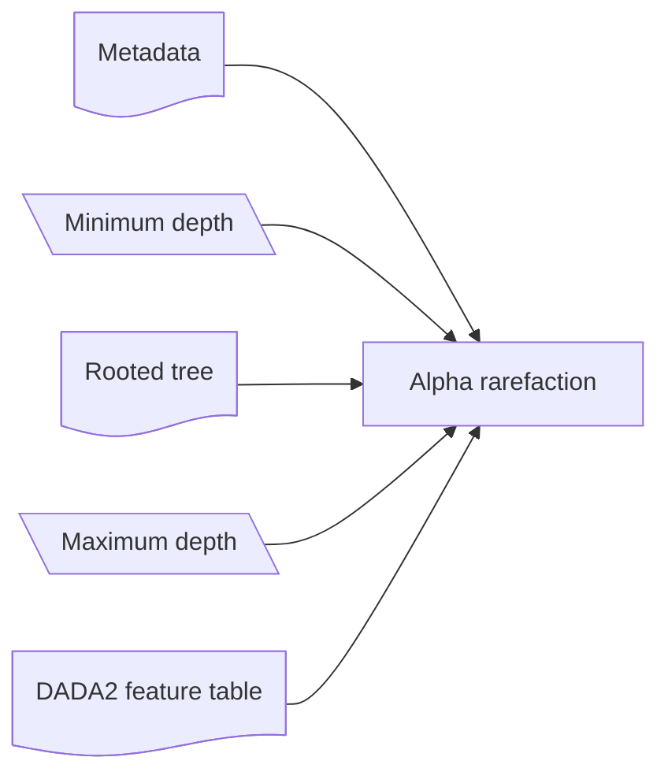
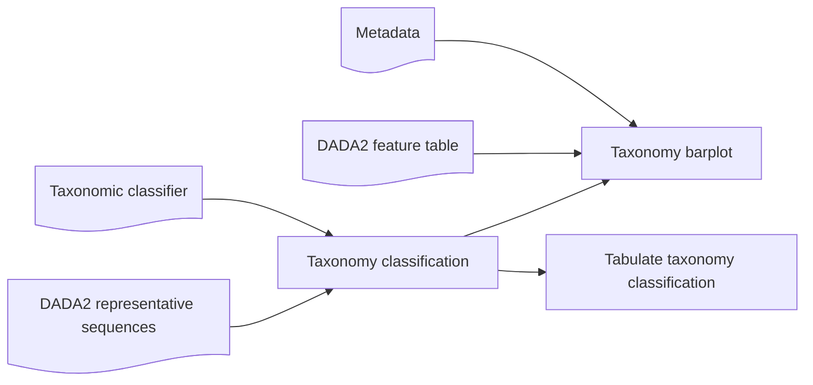
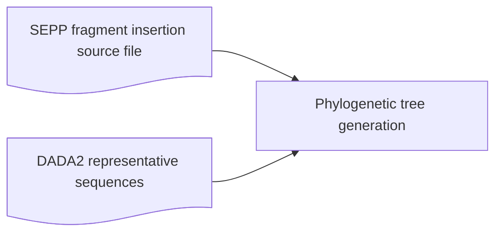

# Workflow diagrams

## QIIME2-III-V-Phylogeny-Rarefaction-Taxonomic-Analysis

## QIIME2 IV: Rarefaction

## QIIME2 V: Taxonomic analysis

## QIIME2 III: Phylogenetic tree for diversity analysis

