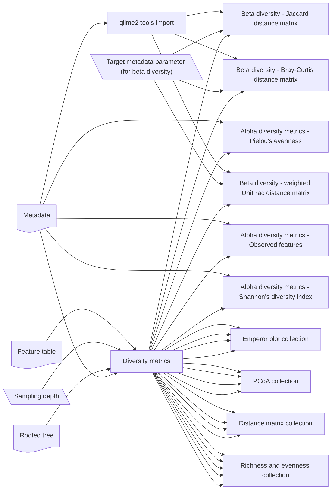

# Workflow diagrams

## QIIME2 VI: Diversity metrics and estimations

```mermaid
graph LR
0["Sampling depth"]@{ shape: lean-l }
1["Metadata"]@{ shape: doc }
2["Feature table"]@{ shape: doc }
3["Rooted tree"]@{ shape: doc }
4["Target metadata parameter (for beta diversity)"]@{ shape: lean-l }
5["qiime2 tools import"]@{ shape: process }
1 --> 5
6["Diversity metrics"]@{ shape: process }
1 --> 6
3 --> 6
0 --> 6
2 --> 6
7["Alpha diversity metrics - Pielou's evenness"]@{ shape: process }
6 --> 7
1 --> 7
8["Alpha diversity metrics - Observed features"]@{ shape: process }
6 --> 8
1 --> 8
9["Alpha diversity metrics - Shannon's diversity index"]@{ shape: process }
6 --> 9
1 --> 9
10["Beta diversity - Jaccard distance matrix"]@{ shape: process }
6 --> 10
4 --> 10
5 --> 10
11["Beta diversity - Bray-Curtis distance matrix"]@{ shape: process }
6 --> 11
4 --> 11
5 --> 11
12["Emperor plot collection"]@{ shape: process }
6 --> 12
6 --> 12
6 --> 12
6 --> 12
13["Beta diversity - weighted UniFrac distance matrix"]@{ shape: process }
6 --> 13
4 --> 13
5 --> 13
14["PCoA collection"]@{ shape: process }
6 --> 14
6 --> 14
6 --> 14
6 --> 14
15["Distance matrix collection"]@{ shape: process }
6 --> 15
6 --> 15
6 --> 15
6 --> 15
16["Richness and evenness collection"]@{ shape: process }
6 --> 16
6 --> 16
6 --> 16
6 --> 16
6 --> 16
```
