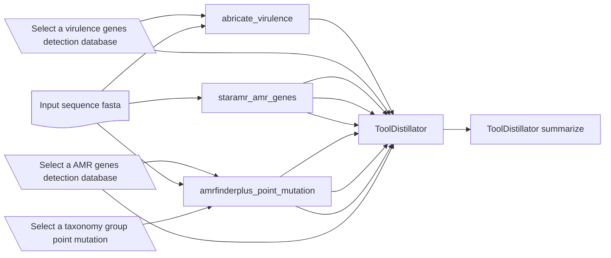

# Workflow diagrams

## amr_gene_detection

```mermaid
graph LR
0["Input sequence fasta"]@{ shape: doc }
1["Select a taxonomy group point mutation"]@{ shape: lean-l }
2["Select a AMR genes detection database"]@{ shape: lean-l }
3["Select a virulence genes detection database"]@{ shape: lean-l }
4["staramr_amr_genes"]@{ shape: process }
0 --> 4
5["amrfinderplus_point_mutation"]@{ shape: process }
2 --> 5
0 --> 5
1 --> 5
6["abricate_virulence"]@{ shape: process }
3 --> 6
0 --> 6
7["ToolDistillator"]@{ shape: process }
6 --> 7
3 --> 7
4 --> 7
4 --> 7
4 --> 7
5 --> 7
5 --> 7
5 --> 7
2 --> 7
8["ToolDistillator summarize"]@{ shape: process }
7 --> 8
```
