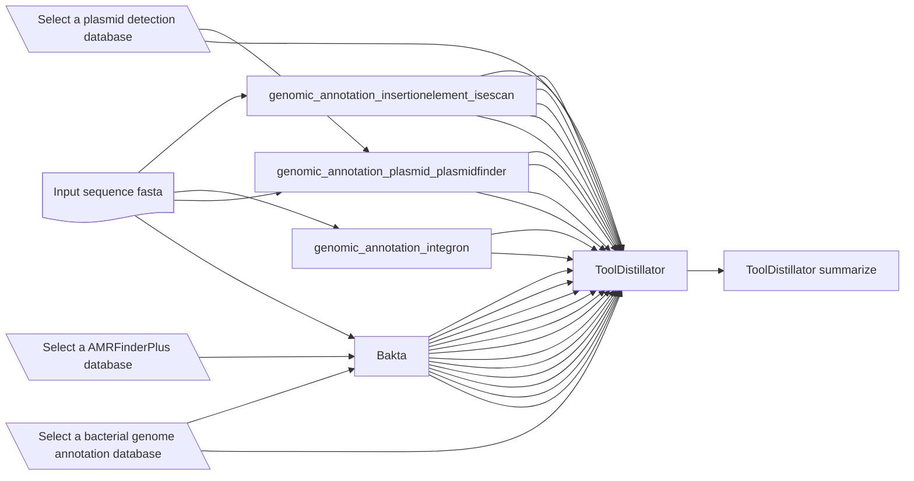

# Workflow diagrams

## bacterial_genome_annotation

```mermaid
graph LR
0["Input sequence fasta"]@{ shape: doc }
1["Select a plasmid detection database"]@{ shape: lean-l }
2["Select a bacterial genome annotation database"]@{ shape: lean-l }
3["Select a AMRFinderPlus database"]@{ shape: lean-l }
4["genomic_annotation_insertionelement_isescan"]@{ shape: process }
0 --> 4
5["genomic_annotation_integron"]@{ shape: process }
0 --> 5
6["genomic_annotation_plasmid_plasmidfinder"]@{ shape: process }
1 --> 6
0 --> 6
7["Bakta"]@{ shape: process }
3 --> 7
2 --> 7
0 --> 7
8["ToolDistillator"]@{ shape: process }
6 --> 8
6 --> 8
6 --> 8
6 --> 8
1 --> 8
4 --> 8
4 --> 8
4 --> 8
4 --> 8
4 --> 8
4 --> 8
5 --> 8
5 --> 8
7 --> 8
7 --> 8
7 --> 8
7 --> 8
7 --> 8
7 --> 8
7 --> 8
7 --> 8
7 --> 8
7 --> 8
7 --> 8
2 --> 8
7 --> 8
9["ToolDistillator summarize"]@{ shape: process }
8 --> 9
```
