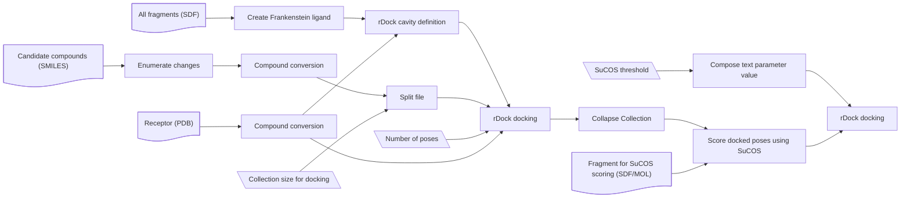

# Workflow diagrams

## Fragment-based virtual screening using rDock for docking and SuCOS for pose scoring

```mermaid
graph LR
0["Number of poses"]@{ shape: lean-l }
1["Receptor (PDB)"]@{ shape: doc }
2["All fragments (SDF)"]@{ shape: doc }
3["Collection size for docking"]@{ shape: lean-l }
4["SuCOS threshold"]@{ shape: lean-l }
5["Fragment for SuCOS scoring (SDF/MOL)"]@{ shape: doc }
6["Candidate compounds (SMILES)"]@{ shape: doc }
7["Compound conversion"]@{ shape: process }
1 --> 7
8["Create Frankenstein ligand"]@{ shape: process }
2 --> 8
9["Compose text parameter value"]@{ shape: process }
4 --> 9
10["Enumerate changes"]@{ shape: process }
6 --> 10
11["rDock cavity definition"]@{ shape: process }
8 --> 11
7 --> 11
12["Compound conversion"]@{ shape: process }
10 --> 12
13["Split file"]@{ shape: process }
12 --> 13
3 --> 13
14["rDock docking"]@{ shape: process }
11 --> 14
13 --> 14
0 --> 14
7 --> 14
15["Collapse Collection"]@{ shape: process }
14 --> 15
16["Score docked poses using SuCOS"]@{ shape: process }
15 --> 16
5 --> 16
17["rDock docking"]@{ shape: process }
9 --> 17
16 --> 17
```
