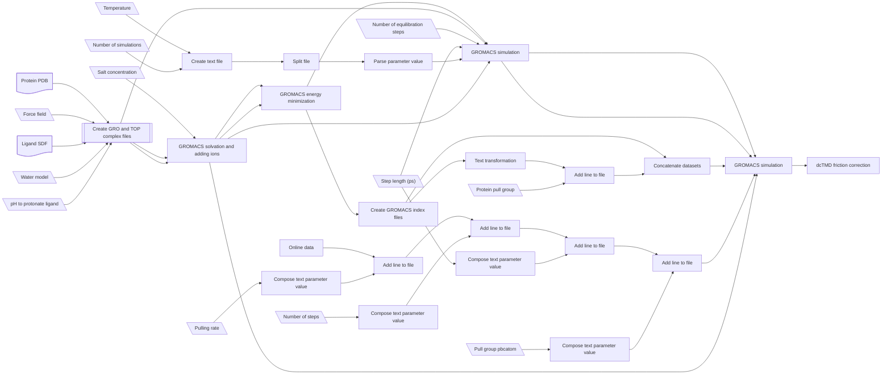
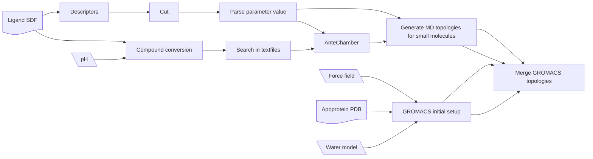

# Workflow diagrams

## dcTMD calculations with GROMACS

```mermaid
graph LR
0["Ligand SDF"]@{ shape: doc }
1["pH to protonate ligand"]@{ shape: lean-l }
2["Protein PDB"]@{ shape: doc }
3["Salt concentration"]@{ shape: lean-l }
4["Water model"]@{ shape: lean-l }
5["Force field"]@{ shape: lean-l }
6["Number of simulations"]@{ shape: lean-l }
7["Temperature"]@{ shape: lean-l }
8["Number of equilibration steps"]@{ shape: lean-l }
9["Online data"]@{ shape: process }
10["Pulling rate"]@{ shape: lean-l }
11["Step length (ps)"]@{ shape: lean-l }
12["Protein pull group"]@{ shape: lean-l }
13["Number of steps"]@{ shape: lean-l }
14["Pull group pbcatom"]@{ shape: lean-l }
15["Create GRO and TOP complex files"]@{ shape: subprocess }
2 --> 15
5 --> 15
0 --> 15
4 --> 15
1 --> 15
16["Create text file"]@{ shape: process }
7 --> 16
6 --> 16
17["Compose text parameter value"]@{ shape: process }
10 --> 17
18["Compose text parameter value"]@{ shape: process }
11 --> 18
19["Compose text parameter value"]@{ shape: process }
13 --> 19
20["Compose text parameter value"]@{ shape: process }
14 --> 20
21["GROMACS solvation and adding ions"]@{ shape: process }
3 --> 21
15 --> 21
15 --> 21
22["Split file"]@{ shape: process }
16 --> 22
23["Add line to file"]@{ shape: process }
9 --> 23
17 --> 23
24["GROMACS energy minimization"]@{ shape: process }
21 --> 24
21 --> 24
25["Parse parameter value"]@{ shape: process }
22 --> 25
26["Add line to file"]@{ shape: process }
23 --> 26
19 --> 26
27["Create GROMACS index files"]@{ shape: process }
24 --> 27
28["GROMACS simulation"]@{ shape: process }
24 --> 28
15 --> 28
8 --> 28
11 --> 28
25 --> 28
21 --> 28
29["Add line to file"]@{ shape: process }
26 --> 29
18 --> 29
30["Text transformation"]@{ shape: process }
27 --> 30
31["Add line to file"]@{ shape: process }
29 --> 31
20 --> 31
32["Add line to file"]@{ shape: process }
30 --> 32
12 --> 32
33["Concatenate datasets"]@{ shape: process }
27 --> 33
32 --> 33
34["GROMACS simulation"]@{ shape: process }
28 --> 34
28 --> 34
33 --> 34
31 --> 34
21 --> 34
35["dcTMD friction correction"]@{ shape: process }
34 --> 35
```

## Create GRO and TOP complex files

```mermaid
graph LR
0["Ligand SDF"]@{ shape: doc }
1["pH"]@{ shape: lean-l }
2["Apoprotein PDB"]@{ shape: doc }
3["Water model"]@{ shape: lean-l }
4["Force field"]@{ shape: lean-l }
5["Descriptors"]@{ shape: process }
0 --> 5
6["Compound conversion"]@{ shape: process }
0 --> 6
1 --> 6
7["GROMACS initial setup"]@{ shape: process }
4 --> 7
2 --> 7
3 --> 7
8["Cut"]@{ shape: process }
5 --> 8
9["Search in textfiles"]@{ shape: process }
6 --> 9
10["Parse parameter value"]@{ shape: process }
8 --> 10
11["AnteChamber"]@{ shape: process }
10 --> 11
9 --> 11
12["Generate MD topologies for small molecules"]@{ shape: process }
10 --> 12
11 --> 12
13["Merge GROMACS topologies"]@{ shape: process }
12 --> 13
12 --> 13
7 --> 13
7 --> 13
```
