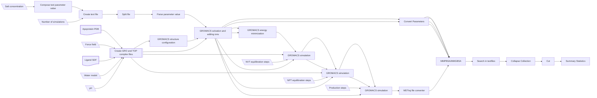
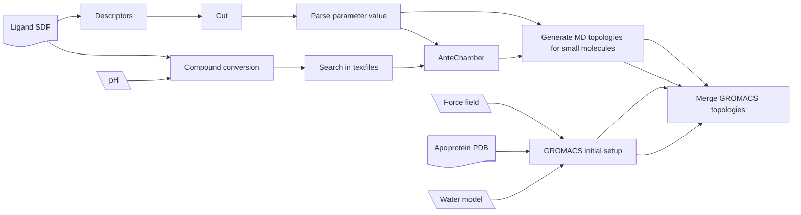

# Workflow diagrams

## MMGBSA calculations with GROMACS

```mermaid
graph LR
0["Salt concentration"]@{ shape: lean-l }
1["Number of simulations"]@{ shape: lean-l }
2["Apoprotein PDB"]@{ shape: doc }
3["Water model"]@{ shape: lean-l }
4["pH"]@{ shape: lean-l }
5["Force field"]@{ shape: lean-l }
6["Ligand SDF"]@{ shape: doc }
7["NVT equilibration steps"]@{ shape: lean-l }
8["NPT equilibration steps"]@{ shape: lean-l }
9["Production steps"]@{ shape: lean-l }
10["Compose text parameter value"]@{ shape: process }
0 --> 10
11["Create GRO and TOP complex files"]@{ shape: subprocess }
2 --> 11
5 --> 11
6 --> 11
3 --> 11
4 --> 11
12["Create text file"]@{ shape: process }
10 --> 12
1 --> 12
13["GROMACS structure configuration"]@{ shape: process }
11 --> 13
14["Split file"]@{ shape: process }
12 --> 14
15["Parse parameter value"]@{ shape: process }
14 --> 15
16["GROMACS solvation and adding ions"]@{ shape: process }
15 --> 16
13 --> 16
11 --> 16
17["GROMACS energy minimization"]@{ shape: process }
16 --> 17
16 --> 17
18["Convert Parameters"]@{ shape: process }
16 --> 18
16 --> 18
19["GROMACS simulation"]@{ shape: process }
17 --> 19
11 --> 19
7 --> 19
16 --> 19
20["GROMACS simulation"]@{ shape: process }
19 --> 20
19 --> 20
11 --> 20
8 --> 20
16 --> 20
21["GROMACS simulation"]@{ shape: process }
20 --> 21
20 --> 21
9 --> 21
16 --> 21
22["MDTraj file converter"]@{ shape: process }
21 --> 22
23["MMPBSA/MMGBSA"]@{ shape: process }
18 --> 23
18 --> 23
18 --> 23
18 --> 23
22 --> 23
24["Search in textfiles"]@{ shape: process }
23 --> 24
25["Collapse Collection"]@{ shape: process }
24 --> 25
26["Cut"]@{ shape: process }
25 --> 26
27["Summary Statistics"]@{ shape: process }
26 --> 27
```

## Create GRO and TOP complex files

```mermaid
graph LR
0["Ligand SDF"]@{ shape: doc }
1["pH"]@{ shape: lean-l }
2["Apoprotein PDB"]@{ shape: doc }
3["Water model"]@{ shape: lean-l }
4["Force field"]@{ shape: lean-l }
5["Descriptors"]@{ shape: process }
0 --> 5
6["Compound conversion"]@{ shape: process }
0 --> 6
1 --> 6
7["GROMACS initial setup"]@{ shape: process }
4 --> 7
2 --> 7
3 --> 7
8["Cut"]@{ shape: process }
5 --> 8
9["Search in textfiles"]@{ shape: process }
6 --> 9
10["Parse parameter value"]@{ shape: process }
8 --> 10
11["AnteChamber"]@{ shape: process }
10 --> 11
9 --> 11
12["Generate MD topologies for small molecules"]@{ shape: process }
10 --> 12
11 --> 12
13["Merge GROMACS topologies"]@{ shape: process }
12 --> 13
12 --> 13
7 --> 13
7 --> 13
```
