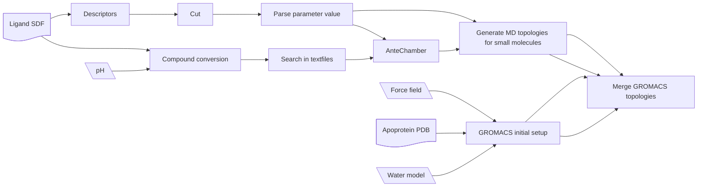

# Workflow diagrams

## Create GRO and TOP complex files

```mermaid
graph LR
0["pH"]@{ shape: lean-l }
1["Ligand SDF"]@{ shape: doc }
2["Apoprotein PDB"]@{ shape: doc }
3["Water model"]@{ shape: lean-l }
4["Force field"]@{ shape: lean-l }
5["Compound conversion"]@{ shape: process }
1 --> 5
0 --> 5
6["Descriptors"]@{ shape: process }
1 --> 6
7["GROMACS initial setup"]@{ shape: process }
4 --> 7
2 --> 7
3 --> 7
8["Search in textfiles"]@{ shape: process }
5 --> 8
9["Cut"]@{ shape: process }
6 --> 9
10["Parse parameter value"]@{ shape: process }
9 --> 10
11["AnteChamber"]@{ shape: process }
10 --> 11
8 --> 11
12["Generate MD topologies for small molecules"]@{ shape: process }
10 --> 12
11 --> 12
13["Merge GROMACS topologies"]@{ shape: process }
12 --> 13
12 --> 13
7 --> 13
7 --> 13
```
