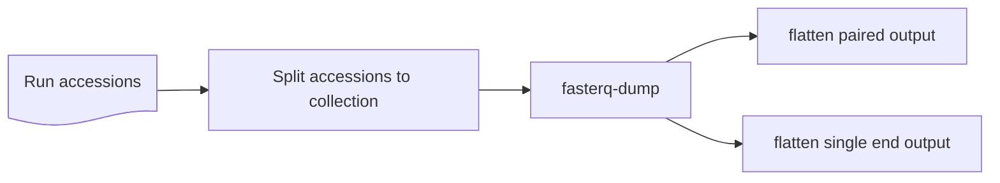

# Workflow diagrams

## Parallel Accession Download

```mermaid
graph LR
0["Run accessions"]@{ shape: doc }
1["Split accessions to collection"]@{ shape: process }
0 --> 1
2["fasterq-dump"]@{ shape: process }
1 --> 2
3["flatten paired output"]@{ shape: process }
2 --> 3
4["flatten single end output"]@{ shape: process }
2 --> 4
```
