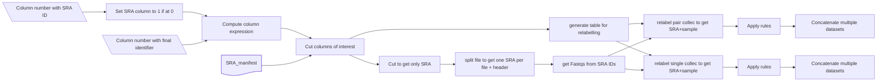

# Workflow diagrams

## sra_manifest_to_concatenated_fastqs_parallel

```mermaid
graph LR
0["SRA_manifest"]@{ shape: doc }
1["Column number with SRA ID"]@{ shape: lean-l }
2["Column number with final identifier"]@{ shape: lean-l }
3["Set SRA column to 1 if at 0"]@{ shape: process }
1 --> 3
4["Compute column expression"]@{ shape: process }
3 --> 4
2 --> 4
5["Cut columns of interest"]@{ shape: process }
4 --> 5
0 --> 5
6["generate table for relabelling"]@{ shape: process }
5 --> 6
7["Cut to get only SRA"]@{ shape: process }
5 --> 7
8["split file to get one SRA per file + header"]@{ shape: process }
7 --> 8
9["get Fastqs from SRA IDs"]@{ shape: process }
8 --> 9
10["relabel pair collec to get SRA+sample"]@{ shape: process }
6 --> 10
9 --> 10
11["relabel single collec to get SRA+sample"]@{ shape: process }
6 --> 11
9 --> 11
12["Apply rules"]@{ shape: process }
10 --> 12
13["Apply rules"]@{ shape: process }
11 --> 13
14["Concatenate multiple datasets"]@{ shape: process }
12 --> 14
15["Concatenate multiple datasets"]@{ shape: process }
13 --> 15
```
