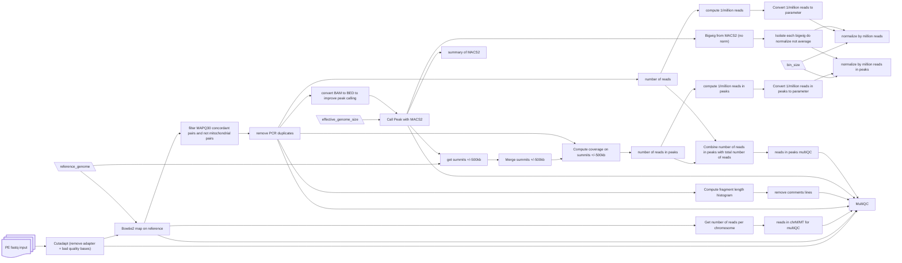

# Workflow diagrams

## ATACseq

```mermaid
graph LR
0["PE fastq input"]@{ shape: docs }
1["reference_genome"]@{ shape: lean-l }
2["effective_genome_size"]@{ shape: lean-l }
3["bin_size"]@{ shape: lean-l }
4["Cutadapt (remove adapter + bad quality bases)"]@{ shape: process }
0 --> 4
5["Bowtie2 map on reference"]@{ shape: process }
4 --> 5
1 --> 5
6["filter MAPQ30 concordant pairs and not mitochondrial pairs"]@{ shape: process }
5 --> 6
7["Get number of reads per chromosome"]@{ shape: process }
5 --> 7
8["remove PCR duplicates"]@{ shape: process }
6 --> 8
9["reads in chrM/MT for multiQC"]@{ shape: process }
7 --> 9
10["convert BAM to BED to improve peak calling"]@{ shape: process }
8 --> 10
11["Compute fragment length histogram"]@{ shape: process }
8 --> 11
12["number of reads"]@{ shape: process }
8 --> 12
13["Call Peak with MACS2"]@{ shape: process }
2 --> 13
10 --> 13
14["remove comments lines"]@{ shape: process }
11 --> 14
15["compute 1/million reads"]@{ shape: process }
12 --> 15
16["Bigwig from MACS2 (no norm)"]@{ shape: process }
13 --> 16
17["get summits +/-500kb"]@{ shape: process }
1 --> 17
13 --> 17
18["summary of MACS2"]@{ shape: process }
13 --> 18
19["Convert 1/million reads to parameter"]@{ shape: process }
15 --> 19
20["Isolate each bigwig do normalize not average"]@{ shape: process }
16 --> 20
21["Merge summits +/-500kb"]@{ shape: process }
17 --> 21
22["normalize by million reads"]@{ shape: process }
3 --> 22
19 --> 22
20 --> 22
23["Compute coverage on summits +/-500kb"]@{ shape: process }
21 --> 23
8 --> 23
24["number of reads in peaks"]@{ shape: process }
23 --> 24
25["compute 1/million reads in peaks"]@{ shape: process }
24 --> 25
26["Combine number of reads in peaks with total number of reads"]@{ shape: process }
24 --> 26
12 --> 26
27["Convert 1/million reads in peaks to parameter"]@{ shape: process }
25 --> 27
28["reads in peaks multiQC"]@{ shape: process }
26 --> 28
29["normalize by million reads in peaks"]@{ shape: process }
3 --> 29
27 --> 29
20 --> 29
30["MultiQC"]@{ shape: process }
4 --> 30
5 --> 30
9 --> 30
8 --> 30
14 --> 30
13 --> 30
28 --> 30
```
