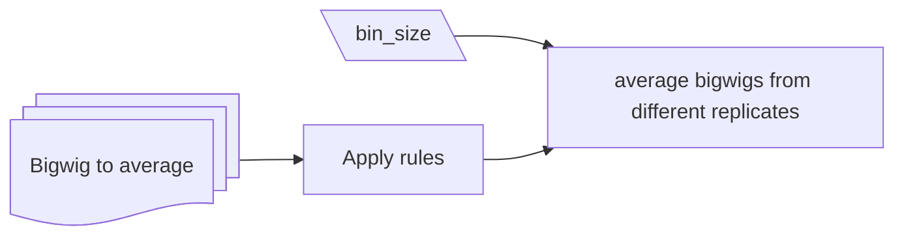

# Workflow diagrams

## Average Bigwig between replicates

```mermaid
graph LR
0["Bigwig to average"]@{ shape: docs }
1["bin_size"]@{ shape: lean-l }
2["Apply rules"]@{ shape: process }
0 --> 2
3["average bigwigs from different replicates"]@{ shape: process }
1 --> 3
2 --> 3
```
