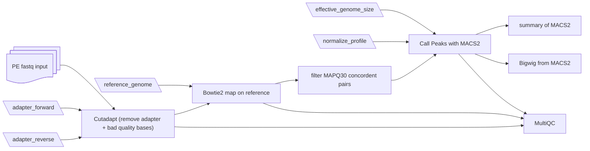

# Workflow diagrams

## ChIPseq_PE

```mermaid
graph LR
0["PE fastq input"]@{ shape: docs }
1["adapter_forward"]@{ shape: lean-l }
2["adapter_reverse"]@{ shape: lean-l }
3["reference_genome"]@{ shape: lean-l }
4["effective_genome_size"]@{ shape: lean-l }
5["normalize_profile"]@{ shape: lean-l }
6["Cutadapt (remove adapter + bad quality bases)"]@{ shape: process }
0 --> 6
1 --> 6
2 --> 6
7["Bowtie2 map on reference"]@{ shape: process }
6 --> 7
3 --> 7
8["filter MAPQ30 concordent pairs"]@{ shape: process }
7 --> 8
9["Call Peaks with MACS2"]@{ shape: process }
5 --> 9
4 --> 9
8 --> 9
10["summary of MACS2"]@{ shape: process }
9 --> 10
11["Bigwig from MACS2"]@{ shape: process }
9 --> 11
12["MultiQC"]@{ shape: process }
6 --> 12
7 --> 12
9 --> 12
```
