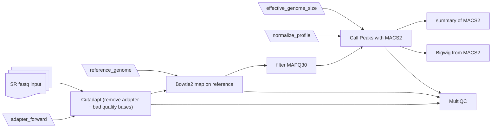

# Workflow diagrams

## ChIPseq_SR

```mermaid
graph LR
0["SR fastq input"]@{ shape: docs }
1["adapter_forward"]@{ shape: lean-l }
2["reference_genome"]@{ shape: lean-l }
3["effective_genome_size"]@{ shape: lean-l }
4["normalize_profile"]@{ shape: lean-l }
5["Cutadapt (remove adapter + bad quality bases)"]@{ shape: process }
0 --> 5
1 --> 5
6["Bowtie2 map on reference"]@{ shape: process }
5 --> 6
2 --> 6
7["filter MAPQ30"]@{ shape: process }
6 --> 7
8["Call Peaks with MACS2"]@{ shape: process }
4 --> 8
3 --> 8
7 --> 8
9["summary of MACS2"]@{ shape: process }
8 --> 9
10["Bigwig from MACS2"]@{ shape: process }
8 --> 10
11["MultiQC"]@{ shape: process }
5 --> 11
6 --> 11
8 --> 11
```
