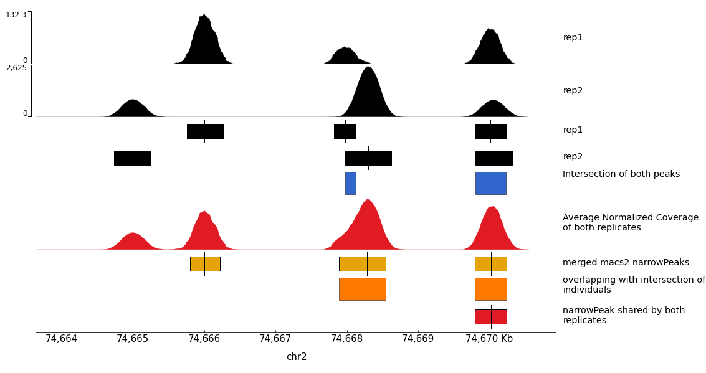

# Consensus peaks Workflow

The goal of this workflow is to get a list of confident peaks with summits from n replicates.

## Inputs dataset

- The workflow needs a single input which is a list of datasets with n BAM where PCR duplicates have been removed (the workflow also works for nested list if you have multiple conditions each with multiple replicates).

## Inputs values

- Minimum number of overlap: Minimum number of replicates into which the final summit should be present.
- effective_genome_size: this is used by MACS2 and may be entered manually (indications are provided for heavily used genomes).
- bin_size: this is the bin sized used to compute the average of normalized profiles. Large values will allow to have a smaller output file but with less resolution while small values will increase computation time and size of the output file to produce a more resolutive bigwig.

## Strategy summary

Here is a generated example to highlight the strategy:

## Processing

- The workflow will:
  - first part:
    - call peaks and compute normalized coverage on each BAM individually
    - average normalized profiles
    - compute the intersection between all peaks and filter when at least x replicate overlaps
  - second part:
    - subset all BAM to get the same number of reads
    - call peaks on all subsetted BAM combined
  - finally, keep only peaks from the second part that have summits overlapping the filtered intersection of the first part.
