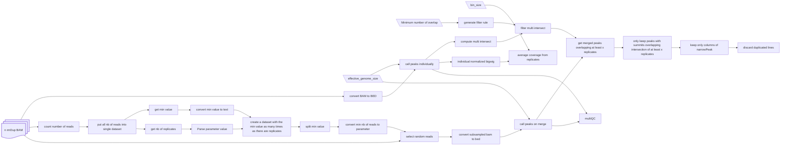

# Workflow diagrams

## Get Confident Peaks From ATAC or CUTandRUN replicates

```mermaid
graph LR
0["n rmDup BAM"]@{ shape: docs }
1["Minimum number of overlap"]@{ shape: lean-l }
2["effective_genome_size"]@{ shape: lean-l }
3["bin_size"]@{ shape: lean-l }
4["convert BAM to BED"]@{ shape: process }
0 --> 4
5["count number of reads"]@{ shape: process }
0 --> 5
6["generate filter rule"]@{ shape: process }
1 --> 6
7["call peaks individually"]@{ shape: process }
2 --> 7
4 --> 7
8["put all nb of reads into single dataset"]@{ shape: process }
5 --> 8
9["compute multi intersect"]@{ shape: process }
7 --> 9
10["individual normalized bigwig"]@{ shape: process }
7 --> 10
11["get min value"]@{ shape: process }
8 --> 11
12["get nb of replicates"]@{ shape: process }
8 --> 12
13["filter multi intersect"]@{ shape: process }
6 --> 13
9 --> 13
14["average coverage from replicates"]@{ shape: process }
3 --> 14
10 --> 14
15["convert min value to text"]@{ shape: process }
11 --> 15
16["Parse parameter value"]@{ shape: process }
12 --> 16
17["create a dataset with the min value as many times as there are replicates"]@{ shape: process }
15 --> 17
16 --> 17
18["split min value"]@{ shape: process }
17 --> 18
19["convert min nb of reads to parameter"]@{ shape: process }
18 --> 19
20["select random reads"]@{ shape: process }
0 --> 20
19 --> 20
21["convert subsampled bam to bed"]@{ shape: process }
20 --> 21
22["call peaks on merge"]@{ shape: process }
2 --> 22
21 --> 22
23["get merged peaks overlapping at least x replicates"]@{ shape: process }
22 --> 23
13 --> 23
24["multiQC"]@{ shape: process }
7 --> 24
22 --> 24
25["only keep peaks with summits overlapping intersection of at least x replicates"]@{ shape: process }
23 --> 25
26["keep only columns of narrowPeak"]@{ shape: process }
25 --> 26
27["discard duplicated lines"]@{ shape: process }
26 --> 27
```
