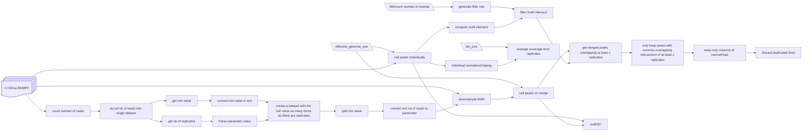

# Workflow diagrams

## Get Confident Peaks From ChIP_PE replicates

```mermaid
graph LR
0["n rmDup BAMPE"]@{ shape: docs }
1["Minimum number of overlap"]@{ shape: lean-l }
2["effective_genome_size"]@{ shape: lean-l }
3["bin_size"]@{ shape: lean-l }
4["count number of reads"]@{ shape: process }
0 --> 4
5["generate filter rule"]@{ shape: process }
1 --> 5
6["call peaks individually"]@{ shape: process }
2 --> 6
0 --> 6
7["put all nb of reads into single dataset"]@{ shape: process }
4 --> 7
8["compute multi intersect"]@{ shape: process }
6 --> 8
9["individual normalized bigwig"]@{ shape: process }
6 --> 9
10["get min value"]@{ shape: process }
7 --> 10
11["get nb of replicates"]@{ shape: process }
7 --> 11
12["filter multi intersect"]@{ shape: process }
5 --> 12
8 --> 12
13["average coverage from replicates"]@{ shape: process }
3 --> 13
9 --> 13
14["convert min value to text"]@{ shape: process }
10 --> 14
15["Parse parameter value"]@{ shape: process }
11 --> 15
16["create a dataset with the min value as many times as there are replicates"]@{ shape: process }
14 --> 16
15 --> 16
17["split min value"]@{ shape: process }
16 --> 17
18["convert min nb of reads to parameter"]@{ shape: process }
17 --> 18
19["downsample BAM"]@{ shape: process }
0 --> 19
18 --> 19
20["call peaks on merge"]@{ shape: process }
2 --> 20
19 --> 20
21["get merged peaks overlapping at least x replicates"]@{ shape: process }
20 --> 21
12 --> 21
22["multiQC"]@{ shape: process }
6 --> 22
20 --> 22
23["only keep peaks with summits overlapping intersection of at least x replicates"]@{ shape: process }
21 --> 23
24["keep only columns of narrowPeak"]@{ shape: process }
23 --> 24
25["discard duplicated lines"]@{ shape: process }
24 --> 25
```
