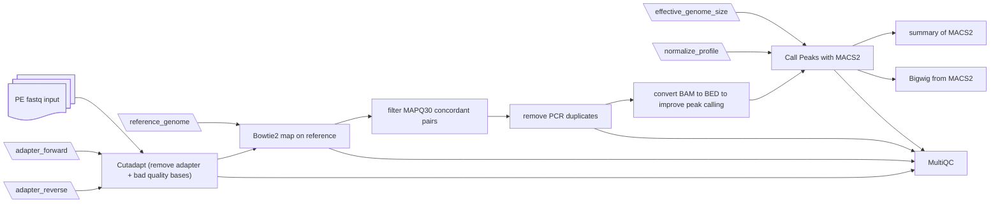

# Workflow diagrams

## CUTandRUN

```mermaid
graph LR
0["PE fastq input"]@{ shape: docs }
1["adapter_forward"]@{ shape: lean-l }
2["adapter_reverse"]@{ shape: lean-l }
3["reference_genome"]@{ shape: lean-l }
4["effective_genome_size"]@{ shape: lean-l }
5["normalize_profile"]@{ shape: lean-l }
6["Cutadapt (remove adapter + bad quality bases)"]@{ shape: process }
0 --> 6
1 --> 6
2 --> 6
7["Bowtie2 map on reference"]@{ shape: process }
6 --> 7
3 --> 7
8["filter MAPQ30 concordant pairs"]@{ shape: process }
7 --> 8
9["remove PCR duplicates"]@{ shape: process }
8 --> 9
10["convert BAM to BED to improve peak calling"]@{ shape: process }
9 --> 10
11["Call Peaks with MACS2"]@{ shape: process }
5 --> 11
4 --> 11
10 --> 11
12["summary of MACS2"]@{ shape: process }
11 --> 12
13["Bigwig from MACS2"]@{ shape: process }
11 --> 13
14["MultiQC"]@{ shape: process }
6 --> 14
7 --> 14
9 --> 14
11 --> 14
```
