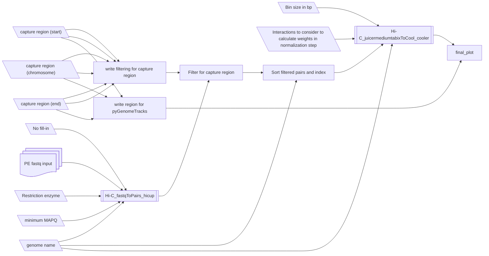
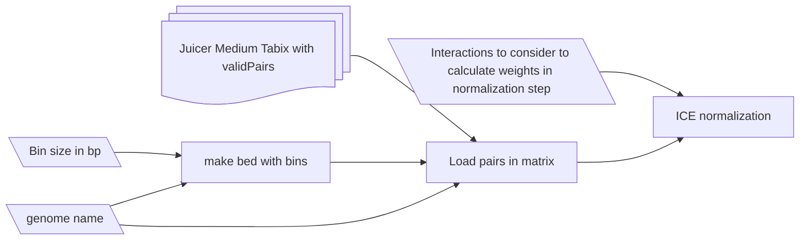
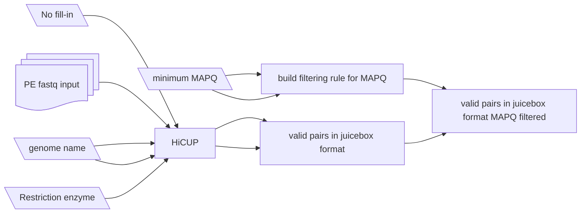

# Workflow diagrams

## cHi-C_fastqToCool_hicup_cooler

```mermaid
graph LR
0["PE fastq input"]@{ shape: docs }
1["genome name"]@{ shape: lean-l }
2["Restriction enzyme"]@{ shape: lean-l }
3["No fill-in"]@{ shape: lean-l }
4["minimum MAPQ"]@{ shape: lean-l }
5["Bin size in bp"]@{ shape: lean-l }
6["Interactions to consider to calculate weights in normalization step"]@{ shape: lean-l }
7["capture region (chromosome)"]@{ shape: lean-l }
8["capture region (start)"]@{ shape: lean-l }
9["capture region (end)"]@{ shape: lean-l }
10["Hi-C_fastqToPairs_hicup"]@{ shape: subprocess }
3 --> 10
0 --> 10
2 --> 10
1 --> 10
4 --> 10
11["write filtering for capture region"]@{ shape: process }
8 --> 11
7 --> 11
9 --> 11
8 --> 11
7 --> 11
9 --> 11
12["write region for pyGenomeTracks"]@{ shape: process }
7 --> 12
8 --> 12
9 --> 12
13["Filter for capture region"]@{ shape: process }
11 --> 13
10 --> 13
14["Sort filtered pairs and index"]@{ shape: process }
13 --> 14
1 --> 14
15["Hi-C_juicermediumtabixToCool_cooler"]@{ shape: subprocess }
5 --> 15
6 --> 15
14 --> 15
1 --> 15
16["final_plot"]@{ shape: process }
12 --> 16
15 --> 16
```

## Hi-C_juicermediumtabixToCool_cooler

```mermaid
graph LR
0["Bin size in bp"]@{ shape: lean-l }
1["genome name"]@{ shape: lean-l }
2["Juicer Medium Tabix with validPairs"]@{ shape: docs }
3["Interactions to consider to calculate weights in normalization step"]@{ shape: lean-l }
4["make bed with bins"]@{ shape: process }
0 --> 4
1 --> 4
5["Load pairs in matrix"]@{ shape: process }
1 --> 5
2 --> 5
4 --> 5
6["ICE normalization"]@{ shape: process }
3 --> 6
5 --> 6
```

## Hi-C_fastqToPairs_hicup

```mermaid
graph LR
0["PE fastq input"]@{ shape: docs }
1["genome name"]@{ shape: lean-l }
2["Restriction enzyme"]@{ shape: lean-l }
3["No fill-in"]@{ shape: lean-l }
4["minimum MAPQ"]@{ shape: lean-l }
5["HiCUP"]@{ shape: process }
3 --> 5
1 --> 5
0 --> 5
2 --> 5
1 --> 5
6["build filtering rule for MAPQ"]@{ shape: process }
4 --> 6
4 --> 6
7["valid pairs in juicebox format"]@{ shape: process }
5 --> 7
5 --> 7
8["valid pairs in juicebox format MAPQ filtered"]@{ shape: process }
6 --> 8
7 --> 8
```
