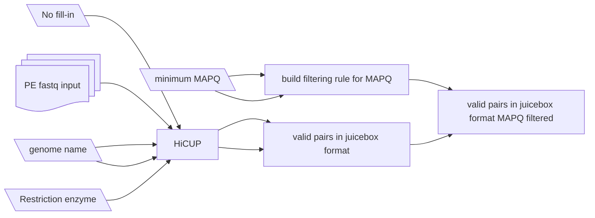

# Workflow diagrams

## Hi-C_fastqToPairs_hicup

```mermaid
graph LR
0["PE fastq input"]@{ shape: docs }
1["genome name"]@{ shape: lean-l }
2["Restriction enzyme"]@{ shape: lean-l }
3["No fill-in"]@{ shape: lean-l }
4["minimum MAPQ"]@{ shape: lean-l }
5["HiCUP"]@{ shape: process }
3 --> 5
1 --> 5
0 --> 5
2 --> 5
1 --> 5
6["build filtering rule for MAPQ"]@{ shape: process }
4 --> 6
4 --> 6
7["valid pairs in juicebox format"]@{ shape: process }
5 --> 7
5 --> 7
8["valid pairs in juicebox format MAPQ filtered"]@{ shape: process }
6 --> 8
7 --> 8
```
