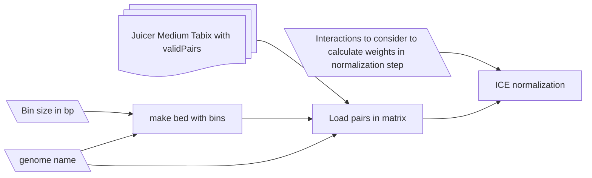

# Workflow diagrams

## Hi-C_juicermediumtabixToCool_cooler

```mermaid
graph LR
0["Bin size in bp"]@{ shape: lean-l }
1["genome name"]@{ shape: lean-l }
2["Juicer Medium Tabix with validPairs"]@{ shape: docs }
3["Interactions to consider to calculate weights in normalization step"]@{ shape: lean-l }
4["make bed with bins"]@{ shape: process }
0 --> 4
1 --> 4
5["Load pairs in matrix"]@{ shape: process }
1 --> 5
2 --> 5
4 --> 5
6["ICE normalization"]@{ shape: process }
3 --> 6
5 --> 6
```
