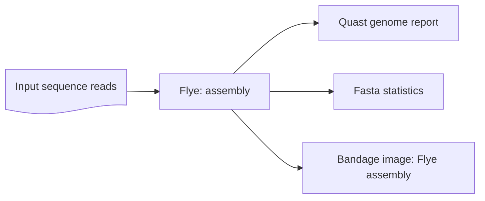

# Workflow diagrams

## Genome assembly with Flye

```mermaid
graph LR
0["Input sequence reads"]@{ shape: doc }
1["Flye: assembly"]@{ shape: process }
0 --> 1
2["Quast genome report"]@{ shape: process }
1 --> 2
3["Fasta statistics"]@{ shape: process }
1 --> 3
4["Bandage image: Flye assembly"]@{ shape: process }
1 --> 4
```
