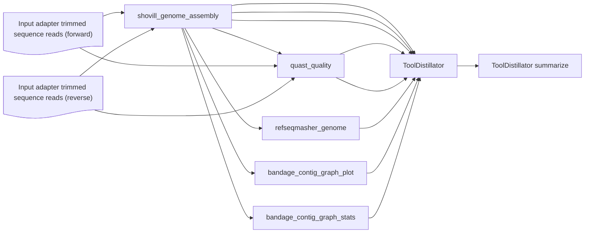

# Workflow diagrams

## Bacterial Genome Assembly using Shovill

```mermaid
graph LR
0["Input adapter trimmed sequence reads (forward)"]@{ shape: doc }
1["Input adapter trimmed sequence reads (reverse)"]@{ shape: doc }
2["shovill_genome_assembly"]@{ shape: process }
0 --> 2
1 --> 2
3["quast_quality"]@{ shape: process }
2 --> 3
0 --> 3
1 --> 3
4["refseqmasher_genome"]@{ shape: process }
2 --> 4
5["bandage_contig_graph_stats"]@{ shape: process }
2 --> 5
6["bandage_contig_graph_plot"]@{ shape: process }
2 --> 6
7["ToolDistillator"]@{ shape: process }
2 --> 7
2 --> 7
2 --> 7
3 --> 7
3 --> 7
4 --> 7
6 --> 7
5 --> 7
8["ToolDistillator summarize"]@{ shape: process }
7 --> 8
```
