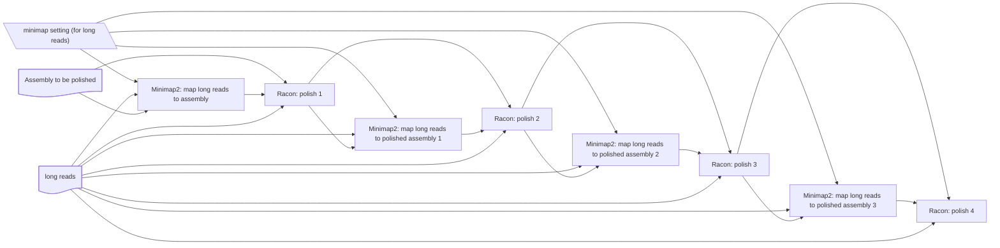

# Workflow diagrams

## Assembly polishing with long reads

```mermaid
graph LR
0["Assembly to be polished"]@{ shape: doc }
1["long reads"]@{ shape: doc }
2["minimap setting (for long reads) "]@{ shape: lean-l }
3["Minimap2: map long reads to assembly"]@{ shape: process }
2 --> 3
1 --> 3
0 --> 3
4["Racon: polish 1"]@{ shape: process }
0 --> 4
3 --> 4
1 --> 4
5["Minimap2: map long reads to polished assembly 1"]@{ shape: process }
2 --> 5
1 --> 5
4 --> 5
6["Racon: polish 2"]@{ shape: process }
4 --> 6
5 --> 6
1 --> 6
7["Minimap2: map long reads to polished assembly 2"]@{ shape: process }
2 --> 7
1 --> 7
6 --> 7
8["Racon: polish 3"]@{ shape: process }
6 --> 8
7 --> 8
1 --> 8
9["Minimap2: map long reads to polished assembly 3"]@{ shape: process }
2 --> 9
1 --> 9
8 --> 9
10["Racon: polish 4"]@{ shape: process }
8 --> 10
9 --> 10
1 --> 10
```
