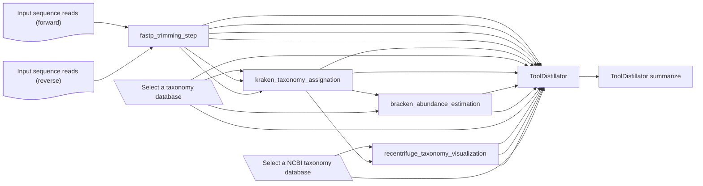

# Workflow diagrams

## Quality and Contamination Control For Genome Assembly

```mermaid
graph LR
0["Input sequence reads (forward)"]@{ shape: doc }
1["Input sequence reads (reverse)"]@{ shape: doc }
2["Select a taxonomy database"]@{ shape: lean-l }
3["Select a NCBI taxonomy database"]@{ shape: lean-l }
4["fastp_trimming_step"]@{ shape: process }
0 --> 4
1 --> 4
5["kraken_taxonomy_assignation"]@{ shape: process }
2 --> 5
4 --> 5
4 --> 5
6["bracken_abundance_estimation"]@{ shape: process }
5 --> 6
2 --> 6
7["recentrifuge_taxonomy_visualization"]@{ shape: process }
3 --> 7
5 --> 7
8["ToolDistillator"]@{ shape: process }
4 --> 8
4 --> 8
4 --> 8
4 --> 8
5 --> 8
2 --> 8
5 --> 8
6 --> 8
6 --> 8
2 --> 8
7 --> 8
7 --> 8
7 --> 8
3 --> 8
9["ToolDistillator summarize"]@{ shape: process }
8 --> 9
```
