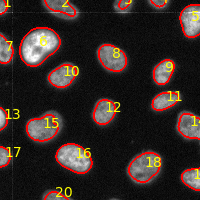

# Segmentation and counting of cell nuclei in fluorescence microscopy images

This workflow performs segmentation and counting of cell nuclei using fluorescence microscopy images. The segmentation step is performed using Otsu thresholding (Otsu, 1979). The workflow is based on the tutorial: https://training.galaxyproject.org/training-material/topics/imaging/tutorials/imaging-introduction/tutorial.html

## Inputs

**`input_image`:** The fluorescence microscopy images to be segmented. Must be the single image channel, which contains the cell nuclei.

## Outputs

**`overlay_image`:** An overlay of the original image and the outlines of the segmentated objects, each also annotated with a unique number.

**`objects_count`:** Table with a single column `objects` and a single row (the actual number of objects).

**`label_image`:** The segmentation result (label map, which contains a unique label for each segmented object).
