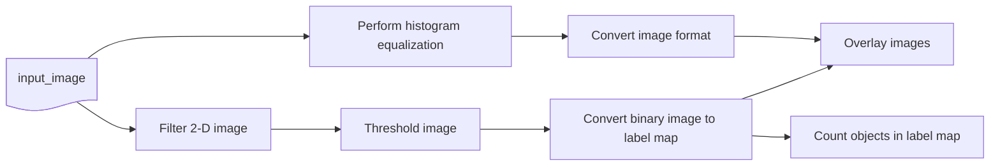

# Workflow diagrams

## Segmentation and counting of cell nuclei in fluorescence microscopy images

```mermaid
graph LR
0["input_image"]@{ shape: doc }
1["Filter 2-D image"]@{ shape: process }
0 --> 1
2["Perform histogram equalization"]@{ shape: process }
0 --> 2
3["Threshold image"]@{ shape: process }
1 --> 3
4["Convert image format"]@{ shape: process }
2 --> 4
5["Convert binary image to label map"]@{ shape: process }
3 --> 5
6["Overlay images"]@{ shape: process }
4 --> 6
5 --> 6
7["Count objects in label map"]@{ shape: process }
5 --> 7
```
