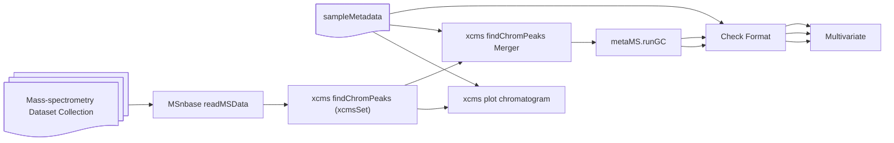

# Workflow diagrams

## Mass spectrometry: GCMS with metaMS

```mermaid
graph LR
0["Mass-spectrometry Dataset Collection"]@{ shape: docs }
1["sampleMetadata"]@{ shape: doc }
2["MSnbase readMSData"]@{ shape: process }
0 --> 2
3["xcms findChromPeaks (xcmsSet)"]@{ shape: process }
2 --> 3
4["xcms plot chromatogram"]@{ shape: process }
3 --> 4
1 --> 4
5["xcms findChromPeaks Merger"]@{ shape: process }
3 --> 5
1 --> 5
6["metaMS.runGC"]@{ shape: process }
5 --> 6
7["Check Format"]@{ shape: process }
6 --> 7
1 --> 7
6 --> 7
8["Multivariate"]@{ shape: process }
7 --> 8
7 --> 8
7 --> 8
```
