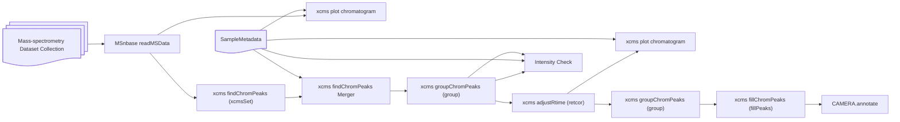

# Workflow diagrams

## Mass spectrometry: LC-MS preprocessing with XCMS

```mermaid
graph LR
0["SampleMetadata"]@{ shape: doc }
1["Mass-spectrometry Dataset Collection"]@{ shape: docs }
2["MSnbase readMSData"]@{ shape: process }
1 --> 2
3["xcms plot chromatogram"]@{ shape: process }
2 --> 3
0 --> 3
4["xcms findChromPeaks (xcmsSet)"]@{ shape: process }
2 --> 4
5["xcms findChromPeaks Merger"]@{ shape: process }
4 --> 5
0 --> 5
6["xcms groupChromPeaks (group)"]@{ shape: process }
5 --> 6
7["xcms adjustRtime (retcor)"]@{ shape: process }
6 --> 7
8["Intensity Check"]@{ shape: process }
6 --> 8
0 --> 8
6 --> 8
9["xcms plot chromatogram"]@{ shape: process }
7 --> 9
0 --> 9
10["xcms groupChromPeaks (group)"]@{ shape: process }
7 --> 10
11["xcms fillChromPeaks (fillPeaks)"]@{ shape: process }
10 --> 11
12["CAMERA.annotate"]@{ shape: process }
11 --> 12
```
